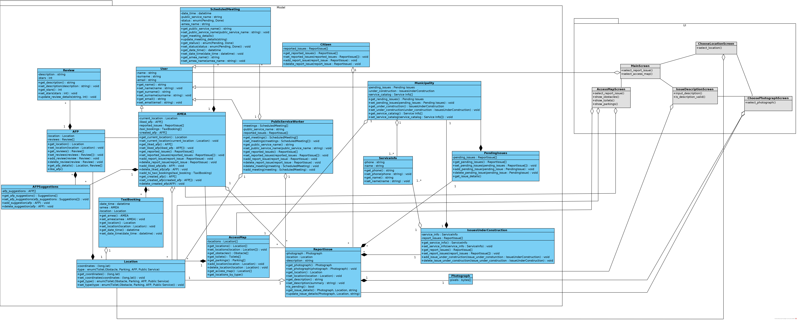

% Class Diagram v1.0
% Move around
% 

\newpage

## Μέλη ομάδας
* Δήμτσας Γιάννης 1054423
* Μαντάς Ελευθέριος 1047128
* Ρούστας Κωνσταντίνος 1054422
* Συμεωνίδης Θεόδωρος 1064870

## Editor
* Δήμτσας Γιάννης 1054423
* Μαντάς Ελευθέριος 1047128
* Ρούστας Κωνσταντίνος 1054422
* Συμεωνίδης Θεόδωρος 1064870

## Peer Reviewer
* Δήμτσας Γιάννης 1054423
* Μαντάς Ελευθέριος 1047128
* Ρούστας Κωνσταντίνος 1054422
* Συμεωνίδης Θεόδωρος 1064870

## Εργαλεία
Markdown, VSCode, GanttProject, Pandoc, Lightshot, [Table generator](https://www.tablesgenerator.com/), [Mockflow](https://www.mockflow.com/), VisualParadigm, [Diagrams.net](https://app.diagrams.net/)

\newpage

