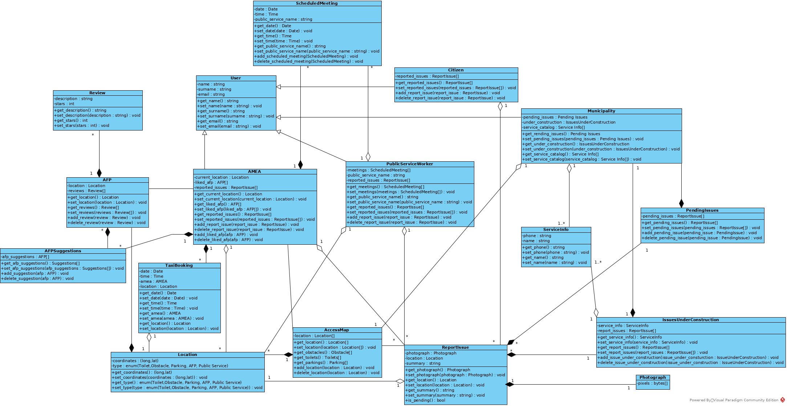

% Domain Model v0.3
% Move around
% 

\newpage

## Μέλη ομάδας
* Δήμτσας Γιάννης 1054423
* Μαντάς Ελευθέριος 1047128
* Ρούστας Κωνσταντίνος 1054422
* Συμεωνίδης Θεόδωρος 1064870

## Editor
* Δήμτσας Γιάννης 1054423
* Μαντάς Ελευθέριος 1047128
* Ρούστας Κωνσταντίνος 1054422
* Συμεωνίδης Θεόδωρος 1064870

## Peer Reviewer
* Δήμτσας Γιάννης 1054423
* Μαντάς Ελευθέριος 1047128
* Ρούστας Κωνσταντίνος 1054422
* Συμεωνίδης Θεόδωρος 1064870

## Εργαλεία
Markdown, VSCode, GanttProject, Pandoc, Lightshot, [Table generator](https://www.tablesgenerator.com/), [Mockflow](https://www.mockflow.com/), VisualParadigm, [Diagrams.net](https://app.diagrams.net/)

\newpage

## Changelog
### v0.2 
* Προσθήκη πεδίων (attributes) σε όλες κλάσεις.
* Αλλαγή μερικών βελών.
* Προσθήκη των κλάσεων User, Issues Under Construction, , Pending Issues, Service Info.
* Μετονομασία της κλάσης Taxi σε Taxi Booking.
* Αφαίρεση της κλάσης Report Management.
* Ενημέρωση του διαγράμματος σχετικά με τις παραπάνω αλλαγές.
* Προσθήκη μετάφρασης στα ονόματα των κλάσεων.
* Ενημέρωση των περιγραφών ορισμένων κλάσεων.

### v0.3
Οι σημαντικές αλλαγές από το v0.2 στο v0.3 έχουν υπογραμμιστεί με \textcolor{blue}{μπλέ} χρώμα.

* Προσθήκη της κλάσης **AFP Suggestions** και της περιγραφής της.
* Προσθήκη των μεθόδων των κλάσεων.
* Αλλαγές στην ορθογραφία

\newpage

## Περιγραφή κλάσεων
* **Access Map (Χάρτης Πρόσβασης)** : Ο χάρτης πρόσβασης που περιλαμβάνει όλα τα σημεία ενδιαφέροντος για ένα Α.Μ.Ε.Α. και ενημερώνεται από τους χρήστες το συστήματος . 
* **Accessibility Friendly Place (AFP ή Ευκόλως Προσβάσιμα Μέρη)** : Οντότητα που περιλαμβάνει τις ιδιότητες ενός μέρους το οποίο είναι ευκόλως προσβάσιμο από Α.Μ.Ε.Α., .
* \textcolor{blue}{\textbf{AFP Suggestions (Προτάσεις Ευκόλως Προσβάσιμων Μερών)} : Οντότητα που περιέχει μια λίστα με όλες τις προτάσεις χώρων.}
* **AMEA** : Οντότητα που αντιστοιχεί σε έναν χρήστη Α.Μ.Ε.Α. του συστήματος. 
* **Citizen (Πολίτης)** : Οντότητα που αντιστοιχεί σε έναν πολίτη που δεν είναι Α.Μ.Ε.Α. και μπορεί να υποβάλλει αναφορές προβλημάτων.
* **Issues Under Construction (Βλάβες υπό Επισκευή)** : Οντότητα που περιέχει μια λίστα με τις αναφορές που βρίσκονται σε κατάσταση "Υπό Επισκευή" και τις πληροφορίες του συνεργείου το οποίο ανέλαβε την επιδιόρθωση της κάθε μίας.
* **Location (Τοποθεσία)** : Αντιστοιχεί σε ένα σημείο στο χάρτη με συντεταγμένες και τύπο, όπως Τουαλέτα, Εμπόδιο, AFP κτλ. .
* **Municipality (Δήμος)** : Οντότητα που αντιστοιχεί στον υπάλληλο του Δήμου που διαχειρίζεται τις αναφορές προβλημάτων και την επίλυση τους.
* **Photograph (Φωτογραφία)** : Οντότητα που αντιστοιχεί στη φωτογραφία μια αναφοράς. 
* **Public Service Worker (Υπάλληλος Δημόσια Υπηρεσίας)** : Οντότητα που αντιστοιχεί σε υπάλληλο μιας Δημόσιας Υπηρεσίας και εξυπηρετεί επισκέπτες Α.Μ.Ε.Α. και μπορεί να υποβάλλει αναφορές προβλημάτων. 
* **Report Issue (Αναφορά Προβλήματος)** : Οντότητα που αντιστοιχεί σε μια αναφορά προβλήματος. Περιέχει τοποθεσία, φωτογραφία και περιγραφή.
* **Pending Issues (Εκκρεμείς Αναφορές)** : Οντότητα που περιέχει μια λίστα με τις αναφορές που έχουν κάνει οι χρήστες και δεν έχουν εξεταστεί ακόμα.
* **Review (Κριτική)** : Οντότητα που αντιστοιχεί σε μια κριτική ενός Accessibility Friendly Place και περιέχει περιγραφή και βαθμολόγηση.
* **Service Info (Πληροφορίες Συνεργείου)** : Οντότητα που περιέχει πληροφορίες για ένα συνεργείο του Δήμου.
* **Scheduled Meeting (Προγραμματισμένη Επίσκεψη)** : Οντότητα που αντιστοιχεί σε προγραμματισμένη επίσκεψη ενός Α.Μ.Ε.Α. και περιέχει πληροφορίες σχετικά με αυτή και την διαχειρίζεται ο Υπάλληλος Δημόσιας Υπηρεσίας.
* **Taxi Booking (Κράτηση TAXI)** : Οντότητα που αντιστοιχεί σε μια κράτηση TAXI που έχει κάνει κάποιος χρήστης Α.Μ.Ε.Α. .
* **User (Χρήστης)** : Οντότητα που περιέχει τις βασικές πληροφορίες ενός χρήστη της εφαρμογής.