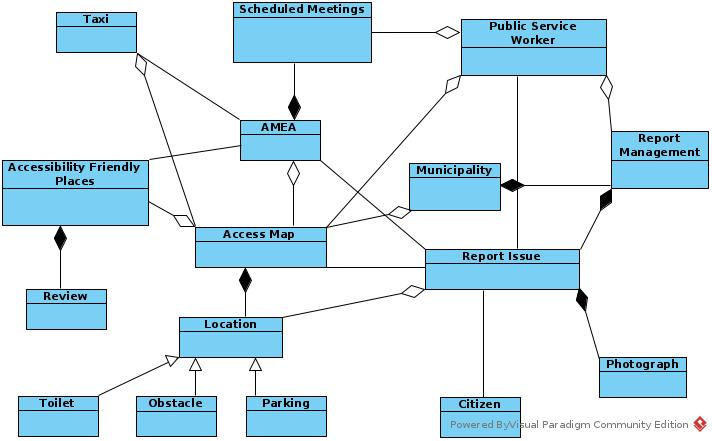

% Domain Model v0.1
% Move around
% 

\newpage

## Μέλη ομάδας
* Δήμτσας Γιάννης 1054423
* Μαντάς Ελευθέριος 1047128
* Ρούστας Κωνσταντίνος 1054422
* Συμεωνίδης Θεόδωρος 1064870

## Editor

## Peer Reviewer

## Εργαλεία
Markdown, VSCode, GanttProject, Pandoc, Lightshot, [Table generator](https://www.tablesgenerator.com/)

* Access Map : 
* Accessibility Friendly Places : 
* AMEA : Οντότητα που αντιστοιχεί σε έναν χρήστη Α.Μ.Ε.Α. του συστήματος. 
* Citizen : 
* Location :
* Municipality :
* Obstacle : Ειδικότερη περίπτωση τοποθεσίας που αναφέρεται σε εμπόδια ή βλάβες που μπορούν να εμποδίσουν την κινητικότητα ενός Α.Μ.Ε.Α. στην πόλη.
* Parking : Ειδικότερη περίπτωση τοποθεσίας που αναφέρεται σε parking.
* Photograph : Αντιστοιχεί σε Report Issue. 
* Public Service Worker :
* Report Issue :
* Report Management :
* Review :
* Scheduled Meetings : 
* Toilet : Ειδικότερη περίπτωση τοποθεσίας που αναφέρεται σε τουαλέτα.
* Taxi : Σύστημα το οποίο επικοινωνεί με το σύστημα του Move Around και χρησιμεύει στη λειτουργία κλήσης.
