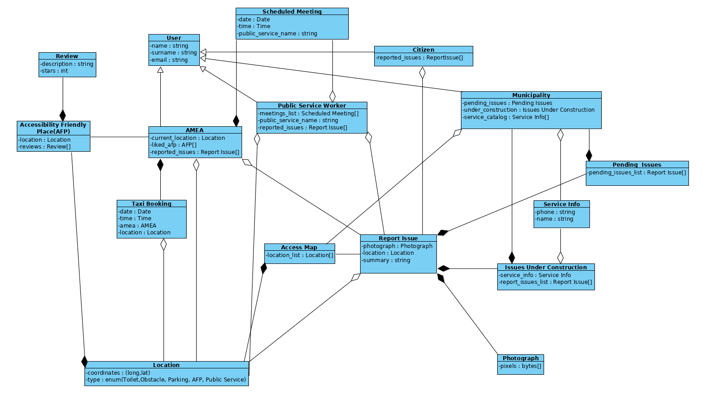

% Domain Model v0.1
% Move around
% 

\newpage

## Μέλη ομάδας
* Δήμτσας Γιάννης 1054423
* Μαντάς Ελευθέριος 1047128
* Ρούστας Κωνσταντίνος 1054422
* Συμεωνίδης Θεόδωρος 1064870

## Editor
* Δήμτσας Γιάννης 1054423
* Μαντάς Ελευθέριος 1047128
* Ρούστας Κωνσταντίνος 1054422
* Συμεωνίδης Θεόδωρος 1064870

## Peer Reviewer
* Δήμτσας Γιάννης 1054423
* Μαντάς Ελευθέριος 1047128
* Ρούστας Κωνσταντίνος 1054422
* Συμεωνίδης Θεόδωρος 1064870

## Εργαλεία
Markdown, VSCode, GanttProject, Pandoc, Lightshot, [Table generator](https://www.tablesgenerator.com/), [Mockflow](https://www.mockflow.com/), VisualParadigm

\newpage

## Περιγραφή κλάσεων
* **Access Map** : Ο χάρτης πρόσβασης που περιλαμβάνει όλα τα σημεία ενδιαφέροντος για ένα Α.Μ.Ε.Α. . 
* **Accessibility Friendly Place** : Οντότητα που περιλαμβάνει τις ιδιότητες ενός μέρους το οποίο είναι ευκόλως προσβάσιμο από Α.Μ.Ε.Α. .
* **AMEA** : Οντότητα που αντιστοιχεί σε έναν χρήστη Α.Μ.Ε.Α. του συστήματος. 
* **Citizen** : Οντότητα που αντιστοιχεί σε έναν πολίτη που δεν είναι Α.Μ.Ε.Α. και μπορεί να υποβάλλει αναφορές προβλημάτων.
* **Location** : Αντιστοιχεί σε ένα σημείο στο χάρτη με συντεταγμένες και ορισμό.
* **Municipality** : Οντότητα που αντιστοιχεί στον υπάλληλο του Δήμου που διαχειρίζεται τις αναφορές προβλημάτων και την επίλυση τους.
* **Obstacle** : Ειδικότερη περίπτωση τοποθεσίας που αναφέρεται σε εμπόδια ή βλάβες που μπορούν να εμποδίσουν την κινητικότητα ενός Α.Μ.Ε.Α. στην πόλη.
* **Parking** : Ειδικότερη περίπτωση τοποθεσίας που αναφέρεται σε parking.
* **Photograph** : Οντότητα που αντιστοιχεί στη φωτογραφία μια αναφοράς. 
* **Public Service Worker** : Οντότητα που αντιστοιχεί σε υπάλληλο μιας Δημόσιας Υπηρεσίας και εξυπηρετεί επισκέπτες Α.Μ.Ε.Α. και μπορεί να υποβάλλει αναφορές προβλημάτων. 
* **Report Issue** : Οντότητα που αντιστοιχεί σε μια αναφορά προβλήματος. Περιέχει τοποθεσία, φωτογραφία και περιγραφή.
* **Report Management** : Οντότητα που περιέχει στο σύνολο των αναφορών με πληροφορίες για την επισκευή τους.
* **Review** : Οντότητα που αντιστοιχεί σε μια κριτική ενός Accessibility Friendly Place και περιέχει περιγραφή και βαθμολόγηση.
* **Scheduled Meeting** : Οντότητα που αντιστοιχεί σε προγραμματισμένη επίσκεψη ενός Α.Μ.Ε.Α. και περιέχει πληροφορίες σχετικά με αυτή.
* **Toilet** : Ειδικότερη περίπτωση τοποθεσίας που αναφέρεται σε τουαλέτα.
* **Taxi** : Σύστημα το οποίο επικοινωνεί με το σύστημα του Move Around και χρησιμεύει στη λειτουργία κλήσης.
