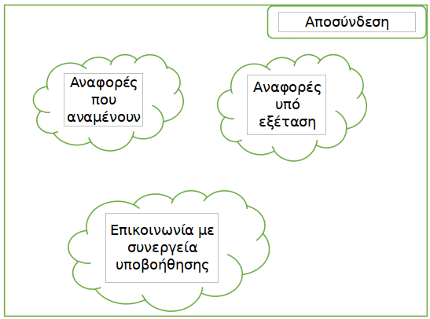

% Project Description v0.1
% Move around
% 

\newpage

## Μέλη ομάδας
* Δήμτσας Γιάννης 1054423
* Μαντάς Ελευθέριος 1047128
* Ρούστας Κωνσταντίνος 1054422
* Συμεωνίδης Θεόδωρος 1064870

## Editor
* Μαντάς Ελευθέριος 1047128

## Peer Reviewer

## Εργαλεία
Markdown, VSCode, GanttProject, Pandoc, Lightshot

\newpage

## Περιγραφή Έργου
Το έργο θα πρέπει να υποστηρίζεται ως εφαρμογή από κινητά τηλέφωνα. Ένας Α.Μ.Ε.Α. θα μπορεί να χρησιμοποιεί ένα χάρτη που θα διευκολύνει τις μετακινήσεις του, να εντοπίζει θέσεις στάθμευσης στη πόλη του, καθώς και θα του δίνει τη δυνατότητα αναφοράς προβλημάτων πρόσβασης. Οι πολίτες θα μπορούν να συνεισφέρουν στον εντοπισμό των δυσπρόσιτων, από Α.Μ.Ε.Α., σημείων της πόλης κάνοντας αναφορά. Στο συνολικό έργο θα συμμετάσχουν και φορείς όπως τράπεζες, δημόσιες υπηρεσίες, σχολεία, πανεπιστήμια. Αυτοί θα έχουν τη δυνατότητα να επικοινωνήσουν με τους Α.Μ.Ε.Α. οι οποίοι θα προγραμματίζουν τη άφιξη τους, ώστε εάν δεν υπάρχει κατάλληλη υποδομή, να τους υποδέχεται κάποιος υπάλληλος για να τους βοηθήσει στη πρόσβασή τους. Την αναφορά κάθε προβλήματος σε κάθε περίπτωση θα εξετάζει ο δήμος της εκάστοτε πόλης και θα θέτει ο ίδιος σε προτεραιότητα τη λύση αυτών ενημερώνοντας τους κατάλληλους φορείς.

## Mockup screens
Παρακάτω παρουσιάζονται τα mock-upscreens για κάθε δυνατό χρήστη της εφαρμογής Move Around.

