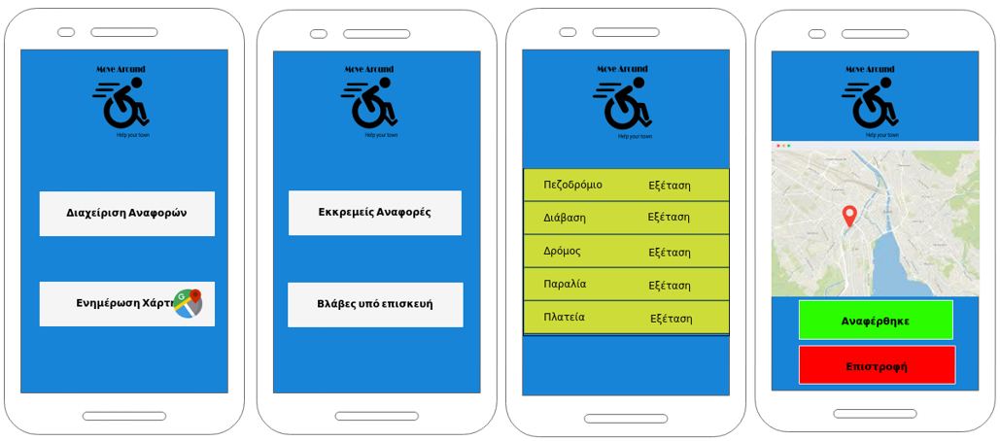

% Project Description v0.1
% Move around
% 

\newpage

## Μέλη ομάδας
* Δήμτσας Γιάννης 1054423
* Μαντάς Ελευθέριος 1047128
* Ρούστας Κωνσταντίνος 1054422
* Συμεωνίδης Θεόδωρος 1064870

## Editor
* Μαντάς Ελευθέριος 1047128

## Peer Reviewer
* Δήμτσας Γιάννης 1054423
* Μαντάς Ελευθέριος 1047128
* Ρούστας Κωνσταντίνος 1054422
* Συμεωνίδης Θεόδωρος 1064870

## Εργαλεία
Markdown, VSCode, GanttProject, Pandoc, Lightshot, MockFlow, [Table generator](https://www.tablesgenerator.com/)

\newpage

### Changelog 
### v0.2

Σε αυτό το παραδοτέο αναθεωρήσαμε την μορφοποίηση των mock-up screens. Οι οθόνες επαναδημιουργήθηκαν με rapid prototyping tool καθώς θεωρήθηκε θεμητή αλλαγή αφού προσδιορίστηκαν με ακρίβεια τα use-cases του project. Οι οθόνες που υλοποιήθηκαν δεν είναι όλες όσες θα έχει η εφαρμογή αλλά ενδεκτικά αυτές που θα δείχναμε στον πελάτη.
Επίσης, προστέθηκε η επιλογή του Α.Μ.Ε.Α. για κλήση taxi και στους φορείς για εξέταση του συνόλου των αναφορών τους.

\newpage

## Περιγραφή Έργου
Το έργο θα πρέπει να υποστηρίζεται ως εφαρμογή από κινητά τηλέφωνα. Ένας Α.Μ.Ε.Α. θα μπορεί να χρησιμοποιεί ένα χάρτη που θα διευκολύνει τις μετακινήσεις του, να εντοπίζει θέσεις στάθμευσης στη πόλη του, να καλεί ένα taxi, καθώς και θα του δίνει τη δυνατότητα αναφοράς προβλημάτων πρόσβασης. 
Οι πολίτες θα μπορούν να συνεισφέρουν στον εντοπισμό των δυσπρόσιτων, από Α.Μ.Ε.Α., σημείων της πόλης κάνοντας αναφορά και ελέγχοντας το σύνολο των αναφορών τους. 
Στο συνολικό έργο θα συμμετάσχουν και φορείς όπως δημόσιες υπηρεσίες, σχολεία, πανεπιστήμια. Αυτοί θα έχουν τη δυνατότητα να επικοινωνήσουν με τους Α.Μ.Ε.Α. οι οποίοι θα προγραμματίζουν τη άφιξη τους, ώστε εάν δεν υπάρχει κατάλληλη υποδομή, να τους υποδέχεται κάποιος υπάλληλος για να τους βοηθήσει στη πρόσβασή τους. Επίσης θα έχουν τη δυνατότητα να αναφέρουν ελλιπείς υποδμές των υπηρεσιών.
Την αναφορά κάθε προβλήματος σε κάθε περίπτωση θα εξετάζει ο Δήμος της εκάστοτε πόλης και θα θέτει ο ίδιος σε προτεραιότητα τη λύση αυτών ενημερώνοντας τους κατάλληλους φορείς.

## Mockup screens
Παρακάτω παρουσιάζονται τα mock-upscreens για κάθε δυνατό χρήστη της εφαρμογής Move Around.

#### Mock-up για «A.M.E.A.
##### Αναφορά Προβλήματος.

#### Mock-up για Πολίτες.
##### Αναφορά Προβλήματος.

#### Mock-up για Φορείς.
##### Προγραμματισμένες Επισκέψεις.

#### Mock-up για Δήμος.
##### Διαχείριση Αναφορών

##### Ενημέρωση Χάρτη

