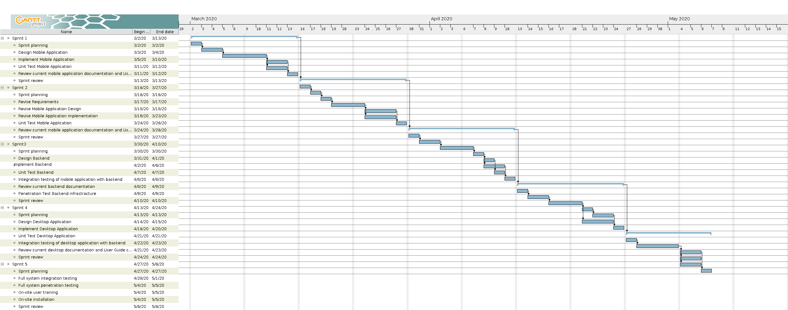
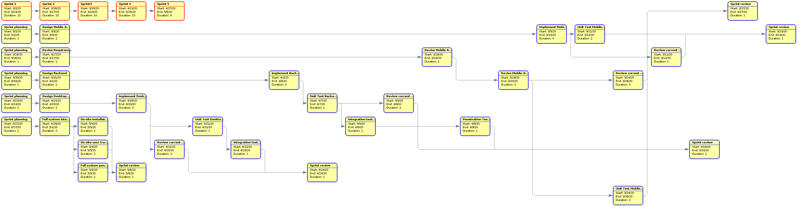

# Project Plan v0.1

Αρχικά επιλέξαμε πως θα χρησιμοποιήσουμε τη μεθοδολογία της οικογένειας Agile για την υλοποίηση του project μας. Καθώς έχουμε να κάνουμε με κοινωνικές ομάδες με ιδιόμορφες ανάγκες τις οποίες μπορεί να μην έχουμε κατανοήσει πλήρως εξ' αρχής. Το δυναμικό αυτό περιβάλλον απαιτήσεων απαιτεί μια επαναληπτική μεθοδολογία με συνεχές feedback. Πιο συγκεκριμένα η μεθοδολογία SCRUM πιστεύουμε πως θα είναι αποτελεσματική λόγω των προδιαγραφών της αλλά και λόγω της εμπειρίας που θα έχουν τα μέλη της ομάδας μας διότι την επιλέξαμε και σαν μέθοδο οργάνωσης αυτού του project.

## Διάγραμμα Gantt

## Διάγραμμα Pert

## Ανάθεση έργου σε ανθρώπινο δυναμικό

## Εκτίμιση κόστους
Γίντονται οι εξής υποθέσεις:
* Η εφαρμογή αναπτύσεται στα πλαίσια διαγωνισμού που έχει προκυρήξει κάποιος δήμος στον οποίο και θα συμμετέχουμε ως εταιρεία η οποία προϋπάρχει.
* Υποθέτουμε ότι ο μέσος μηνιαίος μικτός μισθός πλήρης απασχόλησης ενός προγραμματιστή του επιπέδου μας για 1 μήνα στην Ελλάδα είναι 1200 ΕΥΡΩ.
* Υποθέτουμε ότι ενοικιάζουμε έναν μικρό χώρο από όπου εργάζεται η ομάδα μας.
* Τα κόστη έχουν στρογγυλευθεί προς τα πάνω στις δεκάδες και έχουν προέλθει από συνδιασμό δικής μας έρευνας αλλά και εκτίμισης βάσει της εμπειρίας μας.

### Άμεσο κόστος
* Κόστος εργατικού δυναμικού (1200 ΕΥΡΩ/ΜΗΝΑ * 5 ΜΕΛΗ * 3 ΜΗΝΕΣ = *18000 ΕΥΡΩ*)
* VPS για το περιβαλλον ελέγχου (70 ΕΥΡΩ/ΜΗΝΑ * 2 ΜΗΝΕΣ = *140 ΕΥΡΩ*)
* Επί πληρωμή υπηρεσίες λογισμικού (Trello, Github, Lucidchart, GooglePlay)
    1. Trello : 13 ΕΥΡΩ/ΜΗΝΑ * 3 ΜΗΝΕΣ * 5 ΜΕΛΗ = 180 ΕΥΡΩ
    2. Github : 7 ΕΥΡΩ/ΜΗΝΑ * 3 ΜΗΝΕΣ * 5 ΜΕΛΗ = 110 ΕΥΡΩ
    3. Lucidchart : 9 ΕΥΡΩ/ΜΗΝΑ * 3 ΜΗΝΕΣ * 5 ΜΕΛΗ = 140 ΕΥΡΩ
    4. GooglePlay : 30 ΕΥΡΩ

    Σύνολο : *360 ΕΥΡΩ*
* Δραστηριότητες ενίσχυσης ομαδικού πνεύματος (*200 ΕΥΡΩ*)
* Εκπαίδευση ομάδας σε τεχνολογίες με την αγορά online courses σε συγκεκριμένα tools (*300 ΕΥΡΩ*)

### Έμμεσο κόστος
* Κόστος ενικοίασης χώρου (200 ΕΥΡΩ/ΜΗΝΑ * 3 ΜΗΝΕΣ = *600ΕΥΡΩ*)
* Λοιπά έξοδα χώρου (180 ΕΥΡΩ/ΜΗΝΑ * 3 ΜΗΝΕΣ = *540ΕΥΡΩ*)
* Εταιρικό VPN και VPS για προσωπική μας χρήση (*100 ΕΥΡΩ*)
* Νομικά (*500 ΕΥΡΩ*)

Συνολικό κόστος : 20740 ΕΥΡΩ