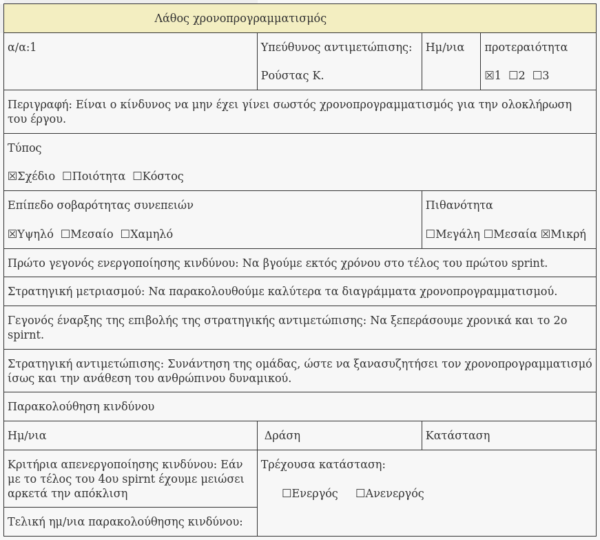
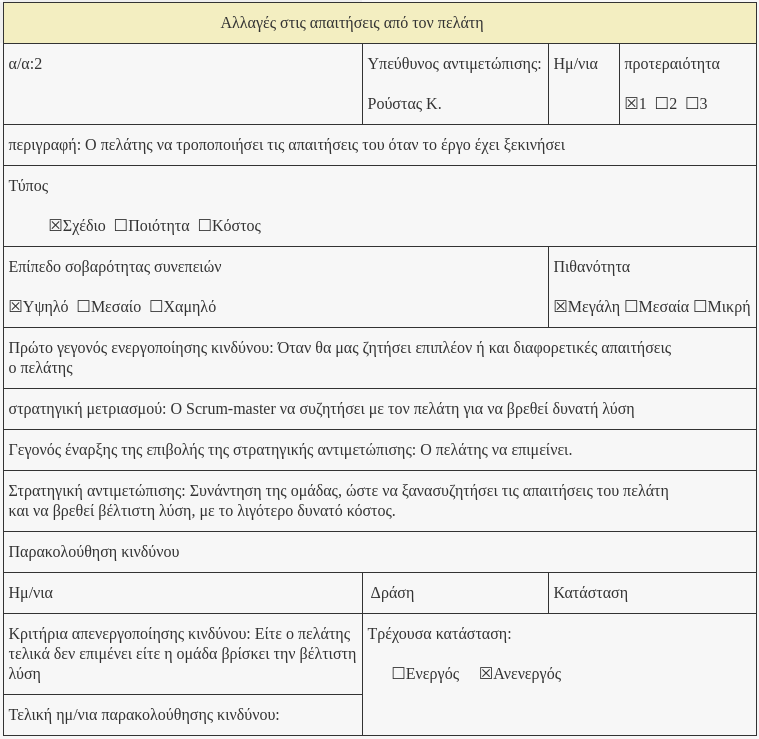
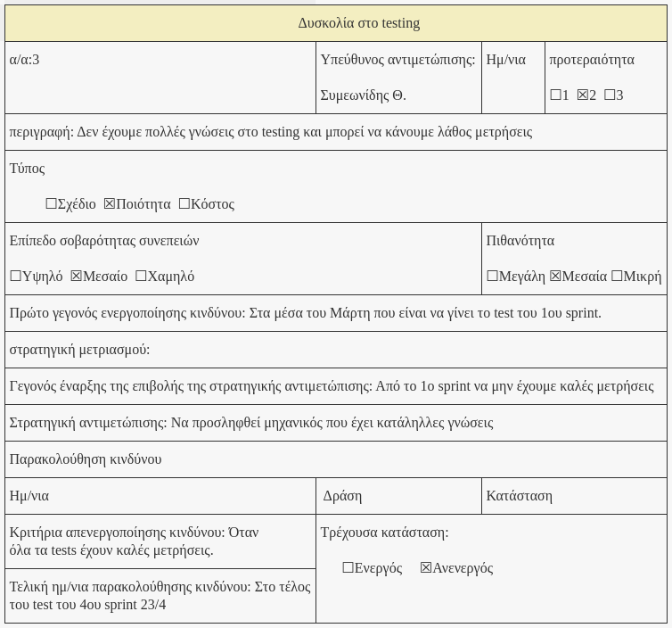
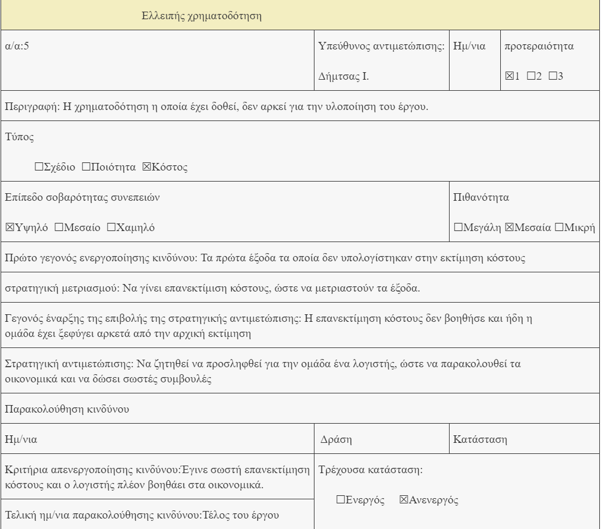
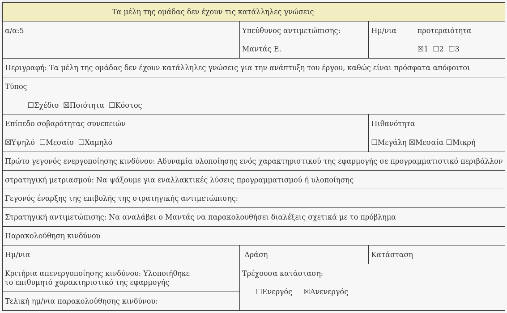
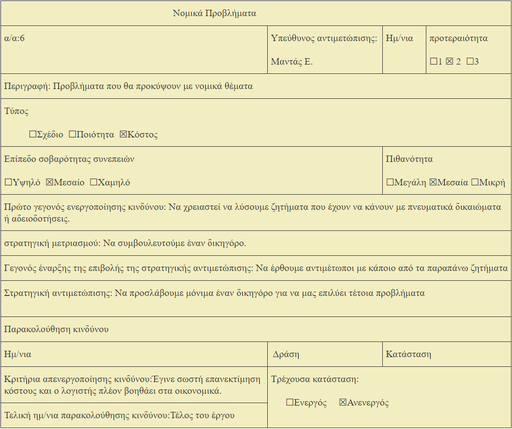

% Risk Assessment v0.4
% Move around
% 

\newpage

## Μέλη ομάδας
* Δήμτσας Γιάννης 1054423
* Μαντάς Ελευθέριος 1047128
* Ρούστας Κωνσταντίνος 1054422
* Συμεωνίδης Θεόδωρος 1064870

## Editor
* Δήμτσας Γιάννης 1054423

## Peer Reviewer
* Ρούστας Κωνσταντινος 1054422
* Συμεωνίδης Θεόδωρος 1064870

## Εργαλεία
Markdown, VSCode, GanttProject, Pandoc, Lightshot, [Table generator](https://www.tablesgenerator.com/), [Mockflow](https://www.mockflow.com/), VisualParadigm, [Diagrams.net](https://app.diagrams.net/)

\newpage

## Changelog
### v0.2 
* Προσθήκη του κινδύνου “ομάδα ανάπτυξης του έργου”
* Προσθήκη νέας φόρμας “τα μέλη της ομάδας δεν έχουν κατάλληλες γνώσεις”

### v0.3
* Προσθήκη του κινδύνου “ελλειπής χρηματοδότηση”
* Προσθήκη νέας φόρμας “ελλειπής χρηματοδότηση”
* Αφαίρεση του κινδύνου “ομάδα ανάπτυξης του έργου”. Τον αφαιρέσαμε διότι δεν ταιριάζει στο risk assessment.
* Αφαίρεση νέας φόρμας “τα μέλη της ομάδας δεν έχουν κατάλληλες γνώσεις”.
* Αφαίρεση του κινδύνου “λάθος χρονοπρογραμματισμός” και σύμπτυξη του στον κίνδυνο χρήσης μεθόδου Scrum. Θεωρήσαμε ότι τα δύο αυτά ρίσκα αλληλοεξαρτόνται, οπότε και τα συμπτύξουμε σε ένα.

### v0.4
Οι σημαντικές αλλαγές από το v0.1 στο v0.2 έχουν υπογραμμιστεί με \textcolor{blue}{μπλέ} χρώμα.

Προστέθηκαν 4 νέοι κίνδυνοι και μερικές ακόμη φόρμες, σύμφωνα με τους νέους κινδύνους:
* Ύπαρξη παρόμοιου προϊόντος στην αγορά
* Νομικά ζητήματα
* Έλλειψη καλού maintenance
* Απειρία Αποφοίτων

\newpage

Όσον αφορά το risk assessment, κρίνεται ότι **μπορούν να γίνουν πολλά λάθη λόγω έλλειψης εμπειρίας, μη καλής επικοινωνίας με τον πελάτη, στη σύνθεση της ομάδας αποφοίτων, αλλά και ζητήματα ελλειπούς χρηματοδότησης**. Παρακάτω περιγράφονται αυτοί οι κίνδυνοι.

* **Oι απαιτήσεις του πελάτη μπορεί να τροποποιηθούν κατά την υλοποίηση του έργου**. Όσο πιο αργά χρονικά γίνονται αλλαγές στις απαιτήσεις, τόσο πιο χρονοβόρα είναι η διαδικασία και αυξάνεται και το κόστος. Σε αυτό μπορεί να παίξουν ρόλο και οι ανεπαρκώς προσδιορισμένες απαιτήσεις του πελάτη από την αρχή, αλλά και η μη σωστή επικοινωνία της ομάδας με τον πελάτη.

* Επιπλέον, το γεγονός ότι η ομάδα αποφοίτων δεν έχει αναλάβει στο παρελθόν την δημιουργία τέτοιων εφαρμογών, δημιουργεί **δυσκολία στο testing**, πιθανόν να μην γίνουν σωστές μετρήσεις και να χρειαστεί να εμβαθύνει παραπάνω τις γνώσεις της πάνω σε αυτό, οπότε το project να πάει πίσω χρονικά.

* Οι **αλλαγές στην τεχνολογία** είναι ένας ακόμη κίνδυνος που μπορεί εμφανιστεί, καθώς το πιο πιθανό είναι **να μην έχει χρησιμοποιηθεί σε προηγούμενα έργα** οπότε ρισκάρεται να ξοδευτεί χρόνος για την εκμάθησή της. Παρομοίως, η μη χρησιμοποίηση των κατάλληλων **tools** για τις ανάγκες του έργου πιθανόν να προκαλέσει επιπλέον κωλύματα στο *workflow* της ομάδος.

* **Τέλος ένας πολύ σημαντικός παράγοντας κινδύνου είναι η ελλειπής χρηματοδότηση**. Η εκτίμηση κόστους έχει γίνει με βάση τον προϋπολογισμό του διαγωνισμού ωστόσο, δεδομένου ότι μπορεί να χρειαστεί να προσληφθεί κάποιος επιπλέον μηχανικός, να χρειαστεί να ξοδευτούν χρήματα που δεν είχαν υπολογιστεί. 

    
* \textcolor{blue}{Ακόμη, \textbf{η ύπαρξη ενός παρόμοιου προϊόντος στην αγορά}, είναι πολλές φορές ένα ρίσκο καταστροφικό για το έργο.}

* \textcolor{blue}{Η ολοκλήρωση του έργου δε σταματά όταν το προϊόν βγει στην αγορά. Η \textbf{έλλειψη καλής συντήρησης (maintenance)} του έργου μπορεί να κρίνει την επιβίωση του στην απαιτητική σύγχρονη αγορά, αφού διάφορα \textbf{software bugs} και άλλα *out-of-date* ζητήματα ίσως κάνουν την εμφάνιση τους.}

* \textcolor{blue}{\textbf{Νομικά προβλήματα} πρέπει να αποφευχθούν από νωρίς, αφού ίσως δημιουργήσουν αναπάντεχα οικονομικά προβλήματα, σπατάλη χρόνου και αποσυντόνιση της ομάδας.} 

* \textcolor{blue}{\textbf{Η ομάδα, η οποία μόλις έχει νικήσει το διαγωνισμό (όπως περιγράφεται στο project plan) είναι άπειροι απόφοιτοι πανεπιστημίου, χωρίς προηγούμενη εμπειρία εργασίας.} Συνεπώς, η έλλειψη επαγγελματισμού και πείρας μπορεί να οδηγήσει σε λανθασμένο χρονοπρογραμματισμό, απειρία στη μεθοδολογία διαχείρισης και εργασίας, πρόωρη απογοήτευση αλλά και έλλειψη σωστών αποφάσεων.}

## Φόρμες Καταγραφής Κινδύνων

