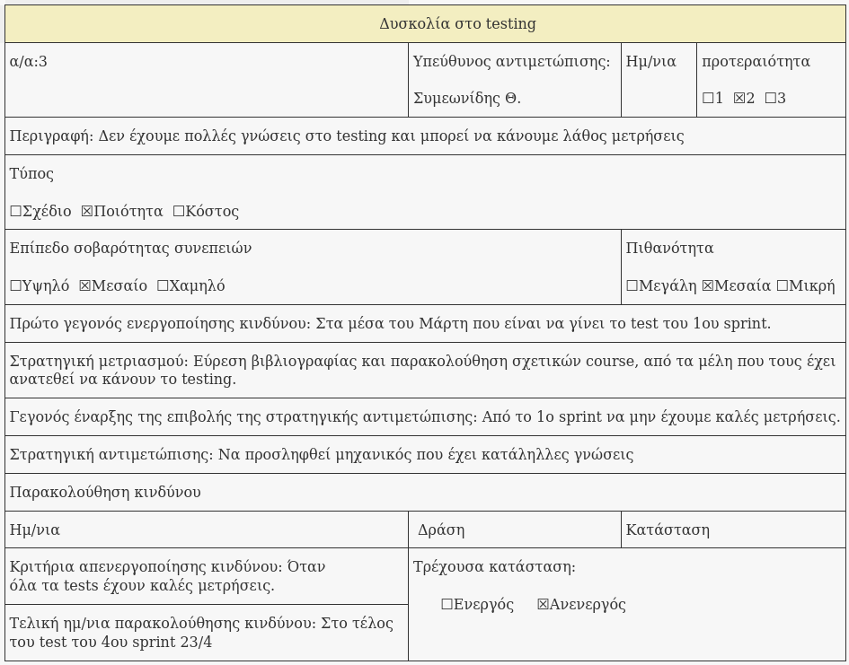

% Risk Assessment v0.1
% Move around
% 

\newpage

## Μέλη ομάδας
* Δήμτσας Γιάννης 1054423
* Μαντάς Ελευθέριος 1047128
* Ρούστας Κωνσταντίνος 1054422
* Συμεωνίδης Θεόδωρος 1064870

## Editor
* Δήμτσας Γιάννης 1054423

## Peer Reviewer
* Ρούστας Κωνσταντινος 1054422
* Συμεωνίδης Θεόδωρος 1064870

## Εργαλεία
Markdown, VSCode, GanttProject, Pandoc, Lightshot, [Table generator](https://www.tablesgenerator.com/)

\newpage

Όσον αφορά το risk assesment, κρίνουμε ότι **μπορούν να γίνουν πολλά λάθη λόγω έλλειψης εμπειρίας, μη καλής επικοινωνίας με τον πελάτη, αλλά και μέσα στη σύνθεση της ομάδας**. Παρακάτω περιγράφονται αυτοί οι κίνδυνοι.
*  Ένας πολύ πιθανός κίνδυνος είναι,  **λόγω της απειρίας στη δημιουργία project plan αλλά και στην κατανομή ανθρώπινων πόρων, να βγούμε εκτός χρονοπρογραμματισμού ή να μην δίνεται το απαραίτητο deadline σε κάθε sprint** πχ ίσως χρειαστεί να παρακολουθήσουμε κάποια courses για υλοποίηση mobile applications καθώς δεν έχουμε πολύ εμπειρία. 
* **Η απειρία του Scrum-master παίζει σημαντικό ρόλο**. Μπορεί να μην υπάρξει καλή επικοινωνία με τον πελάτη καθώς και με συνεργάτες εκτός ομάδας, το οποίο θα επιρρεάσει τόσο το χρόνο υλοποίησης, όσο και το πόσο κοντά σε αυτό που θέλει ο πελάτης θα είναι η εφαρμογή. Ο Scrum-master μπορεί να μην έχει καλές ικανότητες οργανωτικότητας καθώς επίσης και να μην εμπνέει συνεργατικότητα μεταξύ της ομάδας.
* **Επίσης, οι απαιτήσεις του πελάτη μπορεί να τροποποιηθούν κατά την υλοποίηση του έργου**. Όσο πιο αργά χρονικά γίνονται αλλαγές στις απαιτήσεις, τόσο πιο χρονοβόρα είναι η διαδικασία και αυξάνεται και το κόστος. Σε αυτό μπορεί να παίξουν ρόλο και οι ανεπαρκώς προσδιορισμένες απαιτήσεις του πελάτη από την αρχή.
* Επιπλέον, το γεγονός ότι δεν έχουμε αναλάβει στο παρελθόν την δημιουργία τέτοιων εφαρμογών, θα μας κάνει να έχουμε **δυσκολία στο testing**, πιθανόν να μην κάνουμε σωστές μετρήσεις και να χρειαστεί να εμβαθύνουμε παραπάνω τις γνώσεις μας πάνω σε αυτό, οπότε να μας πάει πίσω χρονικά.
* Οι **αλλαγές στην τεχνολογία** είναι ένας ακόμη κίνδυνος που μπορεί εμφανιστεί, καθώς το πιο πιθανό είναι **να μην έχει χρησιμοποιηθεί σε προηγούμενα έργα** οπότε ρισκάρουμε να ξοδευτεί χρόνος για την εκμάθησή της.
* Τέλος και ίσως από τους πιο σημαντικούς παράγοντες κινδύνου, είναι **η ομάδα ανάπτυξης του έργου**. Εδώ υπάρχουν διάφοροι κίνδυνοι: 
    * Η ομάδα να μην καταλάβει σωστά τον σχεδιασμό του έργου, τι ακριβώς τους έχει ανατεθεί να φτιάξουν.
    * Τα μέλη της ομάδας να μην έχουν τις κατάλληλες γνώσεις, καθώς η ομάδα είναι πρόσφατοι απόφοιτοι Πανεπιστημίου.
    * Να μην υπάρχει συνεργατικότητα και σωστή επικοινωνία μεταξύ των μελών.

## Φόρμες Καταγραφής Κινδύνων

