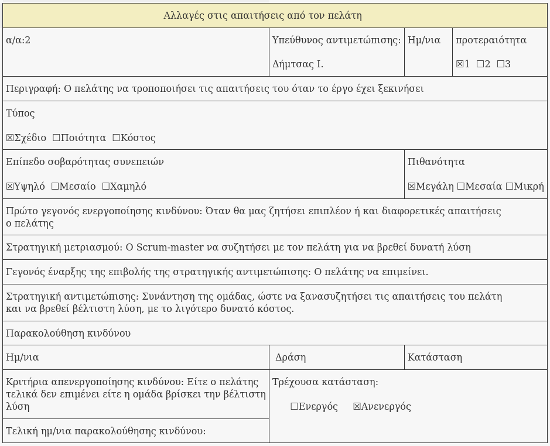
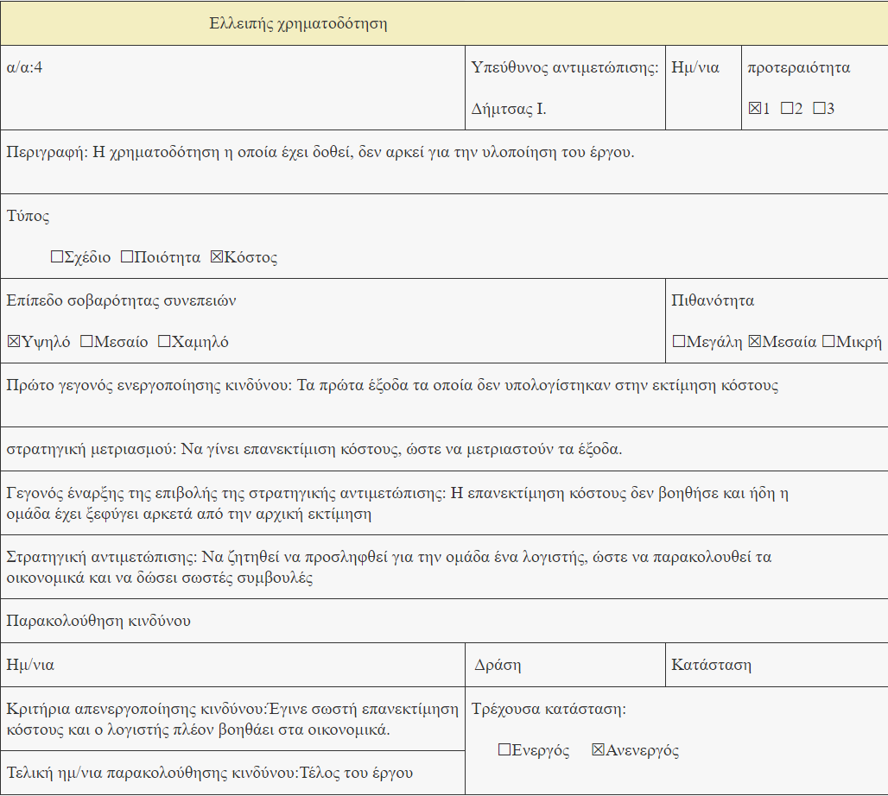

% Risk Assessment v0.1
% Move around
% 

\newpage

## Μέλη ομάδας
* Δήμτσας Γιάννης 1054423
* Μαντάς Ελευθέριος 1047128
* Ρούστας Κωνσταντίνος 1054422
* Συμεωνίδης Θεόδωρος 1064870

## Editor
* Δήμτσας Γιάννης 1054423

## Peer Reviewer
* Ρούστας Κωνσταντινος 1054422
* Συμεωνίδης Θεόδωρος 1064870

## Εργαλεία
Markdown, VSCode, GanttProject, Pandoc, Lightshot, [Table generator](https://www.tablesgenerator.com/), [Mockflow](https://www.mockflow.com/), VisualParadigm, [Diagrams.net](https://app.diagrams.net/)

\newpage

## Changelog
### v0.2 
* Προσθήκη του κινδύνου “ομάδα ανάπτυξης του έργου”
* Προσθήκη νέας φόρμας “τα μέλη της ομάδας δεν έχουν κατάλληλες γνώσεις”

### v0.3
* Προσθήκη του κινδύνου “ελλειπής χρηματοδότηση”
* Προσθήκη νέας φόρμας “ελλειπής χρηματοδότηση”
* Αφαίρεση του κινδύνου “ομάδα ανάπτυξης του έργου”.
* Αφαίρεση νέας φόρμας “τα μέλη της ομάδας δεν έχουν κατάλληλες γνώσεις”.
* Κάποιες μικρές αλλαγές στο ρίσκο της μεθοδολογίας scrum.

\newpage

Όσον αφορά το risk assessment, κρίνουμε ότι **μπορούν να γίνουν πολλά λάθη λόγω έλλειψης εμπειρίας, μη καλής επικοινωνίας με τον πελάτη, στη σύνθεση της ομάδας αποφοίτων, αλλά και ζητήματα ελλειπούς χρηματοδότησης**. Παρακάτω περιγράφονται αυτοί οι κίνδυνοι.

* **Με βαση τη μεθοδολογία οργάνωσης της ομάδας του project plan που είναι η μέθοδος scrum, η ομάδα παίρνει ρίσκο στο κατά πόσο θα ανταποκριθεί στις απαιτήσεις και στο πλάνο του project. Η απειρία του Scrum-master, λόγω του ότι η ομάδα είναι πρόσφατα απόφοιτοι, αλλά και η επαγγελματική απειρία των μελών της ομάδας παίζουν σημαντικό ρόλο στη δημιουργία project plan αλλά και στην κατανομή ανθρώπινων πόρων.**. Αν το project plan δεν γίνει σωστά υπάρχει ο κίνδυνος η ομάδα να μη ανταποκριθεί στα deadlines και να βγει εκτός χρονοπρογραμματισμού. Επίσης, μπορεί να μην υπάρξει καλή επικοινωνία με τον πελάτη καθώς και με συνεργάτες εκτός ομάδας, το οποίο θα επιρρεάσει τόσο το χρόνο υλοποίησης, όσο και το πόσο κοντά σε αυτό που θέλει ο πελάτης θα είναι η εφαρμογή. Ο Scrum-master μπορεί να μην έχει καλές ικανότητες οργανωτικότητας καθώς επίσης και να μην εμπνέει συνεργατικότητα μεταξύ της ομάδας.

* **Επίσης, οι απαιτήσεις του πελάτη μπορεί να τροποποιηθούν κατά την υλοποίηση του έργου**. Όσο πιο αργά χρονικά γίνονται αλλαγές στις απαιτήσεις, τόσο πιο χρονοβόρα είναι η διαδικασία και αυξάνεται και το κόστος. Σε αυτό μπορεί να παίξουν ρόλο και οι ανεπαρκώς προσδιορισμένες απαιτήσεις του πελάτη από την αρχή.

* Επιπλέον, το γεγονός ότι η ομάδα αποφοίτων δεν έχει αναλάβει στο παρελθόν την δημιουργία τέτοιων εφαρμογών, δημιουργεί **δυσκολία στο testing**, πιθανόν να μην γίνουν σωστές μετρήσεις και να χρειαστεί να εμβαθύνει παραπάνω τις γνώσεις της πάνω σε αυτό, οπότε το project να πάει πίσω χρονικά.

* Οι **αλλαγές στην τεχνολογία** είναι ένας ακόμη κίνδυνος που μπορεί εμφανιστεί, καθώς το πιο πιθανό είναι **να μην έχει χρησιμοποιηθεί σε προηγούμενα έργα** οπότε ρισκάρεται να ξοδευτεί χρόνος για την εκμάθησή της. Παρομοίως, η μη χρησιμοποίηση των κατάλληλων **tools** για τις ανάγκες του έργου πιθανόν να προκαλέσει επιπλέον κωλύματα στο *workflow* της ομάδος.

* **Τέλος ένας πολύ σημαντικός παράγοντας κινδύνου είναι η ελλειπής χρηματοδότηση**. Η εκτίμηση κόστους έχει γίνει με βάση τον προυπολογισμό του διαγωνισμού ωστόσο, δεδομένου ότι μπορεί να χρειαστεί να προσληφθεί κάποιος επιπλέον μηχανικός, να χρειαστεί να ξεδευτούν χρήματα που δεν είχαν υπολογιστεί. Για παράδειγμα, νομικές άδειες τις οποίες δεν είχε λάβει υπ’όψιν η ομάδα και θα χρειαστεί να προσληφθεί κάποιος δικηγόρος, επέκταση των μελών και των πόρων κ.α.

## Φόρμες Καταγραφής Κινδύνων

