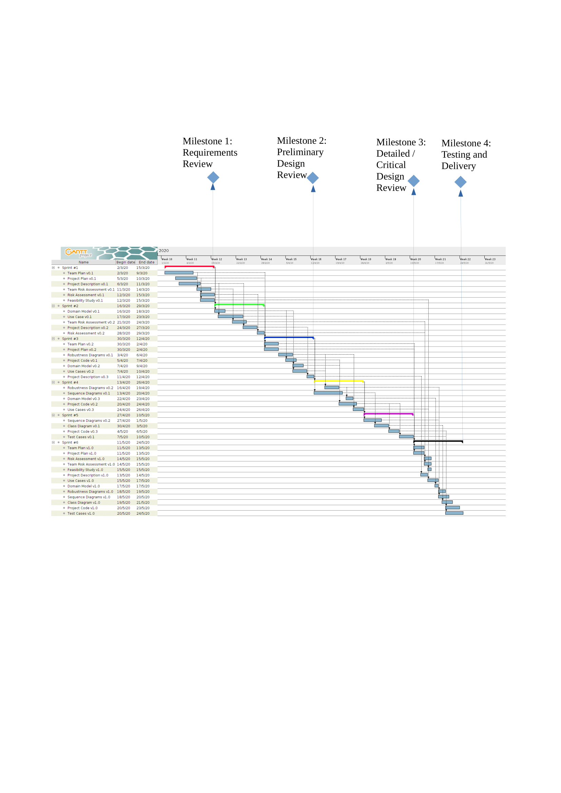
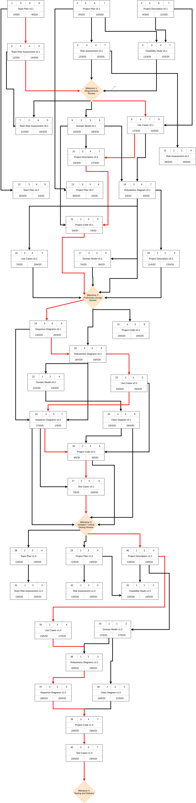
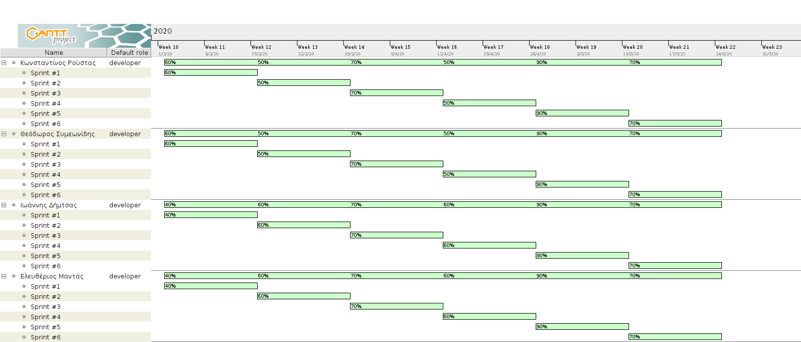

% Team Plan v0.2
% Move around
% 

\newpage

## Μέλη ομάδας
* Δήμτσας Γιάννης 1054423
* Μαντάς Ελευθέριος 1047128
* Ρούστας Κωνσταντίνος 1054422
* Συμεωνίδης Θεόδωρος 1064870

## Editor
* Ρούστας Κωνσταντίνος 1054422

## Peer Reviewer

## Εργαλεία
Markdown, VSCode, GanttProject, Pandoc, Lightshot, [Table generator](https://www.tablesgenerator.com/), [Mockflow](https://www.mockflow.com/), VisualParadigm, [Diagrams.net](https://app.diagrams.net/)

\newpage

## Changelog
### v0.2 
* Αλλαγή των milestones.
* Εκ νέου δημιουργία PERT chart.
* Πρόσθεση milestones στο Gantt chart.
* Μικρές αλλαγές στην μορφοποίηση.

### v0.3 
Προστέθηκαν οι εξής 3 ενότητες:
* Κατανομή Προσπάθειας
* Ανάθεση Έργου
* Συμπεράσματα για τον τρόπο εργασίας

\newpage

## Σύνθεση ομάδας

| Ονοματεπώνυμο μέλους | Α.Μ.    | Έτος |
|----------------------|---------|------|
| Δήμτσας Γιάννης      | 1054423 | 4    |
| Μαντάς Ελευθέριος    | 1047128 | 5    |
| Ρούστας Κωνσταντίνος | 1054422 | 4    |
| Συμεωνίδης Θεόδωρος  | 1064870 | 5    |

## Χρονοπρογραμματισμός
Παρακάτω παρατίθεται ένας αρχικός χρονοπρογραμματισμός για την εργασία μας ως ομάδα.
Να σημειωθεί ότι η αρχική μας εκτίμηση για την υλοποίηση του πρότζεκτ μπορεί να διαφέρει σημαντικά, αφού με τις πρόσφατες εξελίξεις λόγω της έξαρσης του νέου ιού, οι προθεσμίες αλλάζουν. Ως έναρξη του πρότζεκτ έχει ορισθεί η 2/3/2020 και ως λήξη του η 24/5/2020. 

Ως **milestones** έχουν ορισθεί τα 4 milestones της *ICONIX* **Agile** οργάνωσης, τα οποία είναι τα εξής:

* Milestone #1: *Requirements Review*
* Milestone #2: *Preliminary Design Review*
* Milestone #3: *Detailed / Critical Desing Review*
* Milestone #4: *Testing and Delivery*

Ως **τυπικά υποέργα (ΤΥ)** έχουν ορισθεί τα παραδοτέα κάθε *sprint cycle*, τα οποία αναφέρονται στα charts με τα ονόματα τους. Οι εξαρτήσεις τους, όπως απεικονίζονται, ακολουθούν την *ICONIX* **Agile** οργάνωση και πάντα σύμφωνη με τη **SCRUM** method που χρησιμοποιεί η ομάδα.

Επίσης, τα σαββατοκύριακα έχουν συνυπολογιστεί κανονικά ως εργάσιμες μέρες για την εργασία στο πρότζεκτ.

### Critical Path
To critical path απεικονίζεται στο *PERT Chart* με κόκκινες ακμές. Η συνολική του διάρκεια σε ημέρες είναι **72**.

**Ροή** : TY1(8days) &rarr; TY3(4days) &rarr; **Milestone #1** &rarr; TY9(7days) &rarr; TY10(4days) &rarr; TY15(3days) &rarr; **Milestone #2** &rarr; TY19(8days) &rarr; TY20(4days) &rarr; TY23(3days) &rarr; TY24(5days) &rarr; TY26(3days) &rarr; TY27(4days) &rarr; **Milestone #3** &rarr; TY30(2days) &rarr; TY34(3days) &rarr; TY36(2days) &rarr; TY37(3days) &rarr; TY39(4days) &rarr; TY40(5days) &rarr; **Milestone #4** .

\newpage

## How will we work
Η φύση του πρότζεκτ, ο αριθμός μελών της ομάδας αλλά και ο χρονοπρογραμματισμός της υλοποίησης και των παραδοτέων μας ώθησε στο να δουλέψουμε με *SCRUM* μεθοδολογία. Για να προετοιμαστεί κάθε παραδοτέο(τα οποία είναι 6 υπ'αριθμόν) χρειάζονται 2 εβδομάδες εργασίας, όσο είναι και το χρονικό διάστημο των **deadlines** των παραδοτέων. Συνεπώς οργανωνόμαστε για *sprints* διάρκειας 2 εβδομάδων.

Τα **meetings** θα είναι 3 μέσα στη βδομάδα, τα οποία είτε είναι *fixed* το πότε θα γίνουν, είτε γίνονται εκτάκτως όποτε χρειαστεί.

Για την οργάνωση της *SCRUM* μεθόδου που θα χρησιμοποιήσουμε, στήσαμε ένα [Trello Board](https://trello.com/b/0cXG8Lum/software-engineering-project) το οποίο ανανεώνεται καθημερινά από τα μέλη της ομάδας, ανάλογα με το **progress** που υπάρχει. Επίσης χρησιμοποιείται και για *brainstorming*, *customer discussion*.

**Scrum Master** : Ρούστας Κωνσταντίνος

**Development Team** : Δήμτσας Ιωάννης, Συμεωνίδης Θεόδωρος, Μαντάς Ελευθέριος

## Team Communication
Η συννενόηση της ομάδας είναι κομβική για την υλοποίηση του πρότζεκτ, τη σωστή κατανομή εργασίας και την παραγωγικότητα. Αρχικά, τα meetings είχε εκτιμηθεί ότι θα γίνονται στην πλειοψηφία τους *face-to-face*, ωστόσο οι πρόσφατες εξελίξεις με τον νέο ιό τελικά μας οδήγησαν στο να κάνουμε ***online meetings***.

Για τα *meetings* χρησιμοποιούμε το *Discord* για άμεση επικοινωνία και το *Viber* κατά περίπτωση.

Για *file sharing* χρησιμοποιούμε το [Github Repository](https://github.com/Elite-Build-Team/move-around) του πρότζεκτ αλλά και τα άμεσα μηνύματα.

## More tools
* Για την ανάπτυξη του κώδικα του έργου θα χρησιμοποιηθεί η ***Python*** με *αντικειμενοστραφή* προσανατολισμό.
* Τα **IDEs** που θα χρησιμοποιηθούν είναι ***Pycharm*** και ***Visual Studio Code***.
* Τα *τεχνικά κείμενα* των παραδοτέων φτιάχνονται σε ***Word*** και η μορφοποίηση τους στο ***Github*** είναι με ***Markdown Language***.

## Ανάθεση Έργου
Η ανάθεση έργου στα μέλη της ομάδας και τα ποσοστά των **resource units** που ανατέθηκαν ισχύουν εφ'όσον τα μέλη της ομάδας είναι φοιτητές πανεπιστημίου. Άρα, στην ουσία, τα μέλη της ομάδας δουλέυουν και σε άλλα project παράλληλα με εκείνο της Τεχνολογίας Λογισμικού (*part-time commitment*). Συνεπώς, η ανάθεση έργου, σύμφωνα με το τελικό Gantt Chart, διαμορφώνεται ως εξής :

## Κατανομή Προσπάθειας
Η ομάδα συμφωνεί ομόφωνα ότι η προσπάθεια όλων των μελών για την ολοκλήρωση του project ήταν ισοδύναμη.

## Συμπεράσματα για τον τρόπο εργασίας
Τα μέλη της ομάδας είναι σε αρκετά μεγάλο βαθμό ευχαριστημένα από τον τρόπο συνεργασίας της ομάδας, ο οποίος κρίνεται επιτυχής.
Η ομάδα ακολούθησε κατά κόρον τη *SCRUM* μεθοδολογία διαχείρισης και προσομείωσε ως ένα σημείο τις μεθόδους της (*sprints, roles*). Οι υπάρχουσες επιδημιολογικές συνθήκες ανάγκασαν την ομάδα να δουλεύει εξ αποστάσεως για το μεγαλύτερο μέρος του πρότζεκτ. Ωστόσο, ανταποκρίθηκε, οργάνωσε τα online meetings με τέτοιο τρόπο ώστε να αξιοποιείται ο χρόνος εργασίας στο μέγιστο. Συνήθως, κάθε sprint οργανώνοταν ως εξής :
* **Εβδομάδα Πρώτη** : Στην αρχή της εβδομάδας η ομάδα έκανε το χρονοπρογραμματισμό της για το sprint διάρκειας των δύο εβδομάδων. Ανέλυε τα feedbacks, έθετε προτεραιότητες για τα επιμέρους τεχνικά υποέργα και στο υπόλοιπο της εβδομάδας εργαζόταν για την ολοκλήρωση τους.
* **Εβδομάδα Δεύτερη** : Κατά τη δεύτερη εβδομάδα και ενώ το κάθε μέλος είχε ολοκληρώσει τη σύνθεση των επιμέρους τεχνικών υποέργων, η ομάδα μαζεύοταν για να κάνει review τα τεχνικά κείμενα. Εφ'όσον όλη η ομάδα συμφωνούσε για την ποιότητα του καθενός από τα τεχνικά κείμενα, ήταν έτοιμα προς παράδοση.

Κατά τη διάρκεια των δύο εβδομάδων, τα online meetings ήταν πολύ περισσότερα από όσα υπολογίζαμε. Πολλές φορές η ανάπτυξη των υποέργων γινόταν ανά pairs (ώστε να βελτιωθεί η ποιότητα και να μειωθούν οι διχογνωμίες).

Αν μπορούσε να γίνει κάποια αλλαγή, αυτή θα ήταν στον καθορισμό των sprint cycles, εφ'όσον ο χρονοπρογραμματισμός πρέπει να ακολουθείται με απόλυτη ακρίβεια.