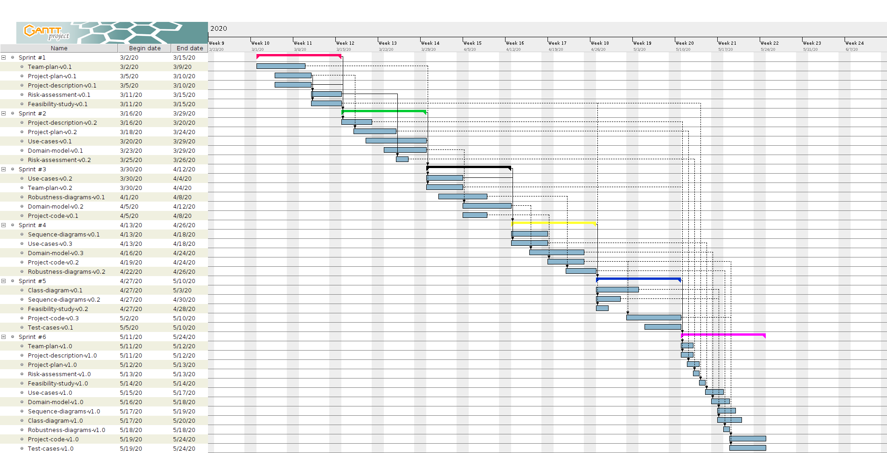
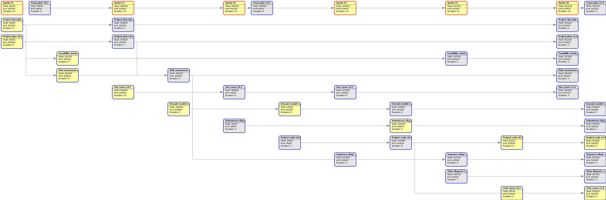

% Team Plan v0.1
% Move around
% 

\newpage

## Μέλη ομάδας
* Δήμτσας Γιάννης 1054423
* Μαντάς Ελευθέριος 1047128
* Ρούστας Κωνσταντίνος 1054422
* Συμεωνίδης Θεόδωρος 1064870

## Editor
* Ρούστας Κωνσταντίνος 1054422

## Peer Reviewer

## Εργαλεία
Markdown, VSCode, GanttProject, Pandoc, Lightshot

\newpage

## Χρονοπρογραμματισμός
Παρακάτω παρατίθεται ένας αρχικός χρονοπρογραμματισμός για την εργασία μας ως ομάδα.
Να σημειωθεί ότι η αρχική μας εκτίμηση για την υλοποίηση του πρότζεκτ μπορεί να διαφέρει σημαντικά, αφού με τις πρόσφατες εξελίξεις λόγω της έξαρσης του νέου ιού, οι προθεσμίες αλλάζουν. Ως έναρξη του πρότζεκτ έχει ορισθεί η 2/3/2020 και ως λήξη του η 24/5/2020. 

Ως **milestones** έχουν ορισθεί τα **sprints** των δύο εβδομάδων, αφού τότε γίνεται η απαραίτητη πρόοδος.

Ως **τυπικά υποέργα (ΤΥ)** έχουν ορισθεί τα παραδοτέα κάθε *sprint cycle*, τα οποία αναφέρονται στα charts με τα ονόματα τους. Οι εξαρτήσεις τους, όπως απεικονίζονται, ακολουθούν την *ICONIX* **Agile** οργάνωση και πάντα σύμφωνη με τη **SCRUM** method που χρησιμοποιεί η ομάδα.

Επίσης, τα σαββατοκύριακα έχουν συνυπολογιστεί κανονικά ως εργάσιμες μέρες για την εργασία στο πρότζεκτ.

\newpage

## How will we work
Η φύση του πρότζεκτ, ο αριθμός μελών της ομάδας αλλά και ο χρονοπρογραμματισμός της υλοποίησης και των παραδοτέων μας ώθησε στο να δουλέψουμε με *SCRUM* μεθοδολογία. Για να προετοιμαστεί κάθε παραδοτέο(τα οποία είναι 6 υπ'αριθμόν) χρειάζονται 2 εβδομάδες εργασίας, όσο είναι και το χρονικό διάστημο των **deadlines** των παραδοτέων. Συνεπώς οργανωνόμαστε για *sprints* διάρκειας 2 εβδομάδων.

Τα **meetings** θα είναι 3 μέσα στη βδομάδα, τα οποία είτε είναι *fixed* το πότε θα γίνουν, είτε γίνονται εκτάκτως όποτε χρειαστεί.

Για την οργάνωση της *SCRUM* μεθόδου που θα χρησιμοποιήσουμε, στήσαμε ένα [Trello Board](https://trello.com/b/0cXG8Lum/software-engineering-project) το οποίο ανανεώνεται καθημερινά από τα μέλη της ομάδας, ανάλογα με το **progress** που υπάρχει. Επίσης χρησιμοποιείται και για *brainstorming*, *customer discussion*.

**Scrum Master : Ρούστας Κωνσταντίνος**

**Development Team : Δήμτσας Ιωάννης, Συμεωνίδης Θεόδωρος, Μαντάς Ελευθέριος**

## Team Communication
Η συννενόηση της ομάδας είναι κομβική για την υλοποίηση του πρότζεκτ, τη σωστή κατανομή εργασίας και την παραγωγικότητα. Αρχικά, τα meetings είχε εκτιμηθεί ότι θα γίνονται στην πλειοψηφία τους *face-to-face*, ωστόσο οι πρόσφατες εξελίξεις με τον νέο ιό τελικά μας οδήγησαν στο να κάνουμε ***online meetings***.

Για τα *meetings* χρησιμοποιούμε το *Discord* για άμεση επικοινωνία και το *Viber* κατά περίπτωση.

Για *file sharing* χρησιμοποιούμε το [Github Repository](https://github.com/Elite-Build-Team/software-engineering-2020) του πρότζεκτ αλλά και τα άμεσα μηνύματα.

## More tools
* Για την ανάπτυξη του κώδικα του έργου θα χρησιμοποιηθεί η ***Python*** με *αντικειμενοστραφή* προσανατολισμό.
* Τα **IDEs** που θα χρησιμοποιηθούν είναι ***Pycharm*** και ***Visual Studio Code***.
* Τα *τεχνικά κείμενα* των παραδοτέων φτιάχνονται σε ***Word*** και η μορφοποίηση τους στο ***Github*** είναι με ***Markdown Language***.

todo:
