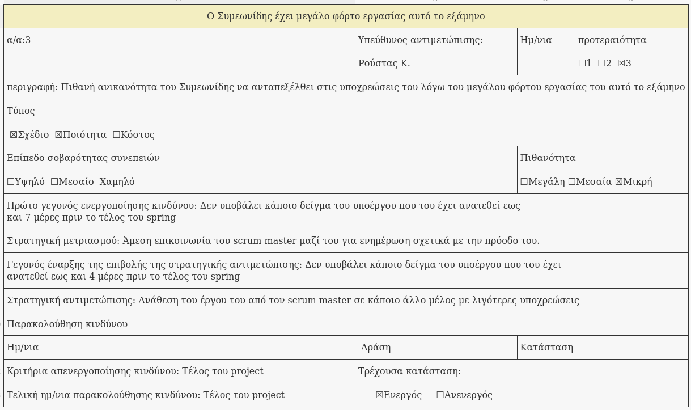
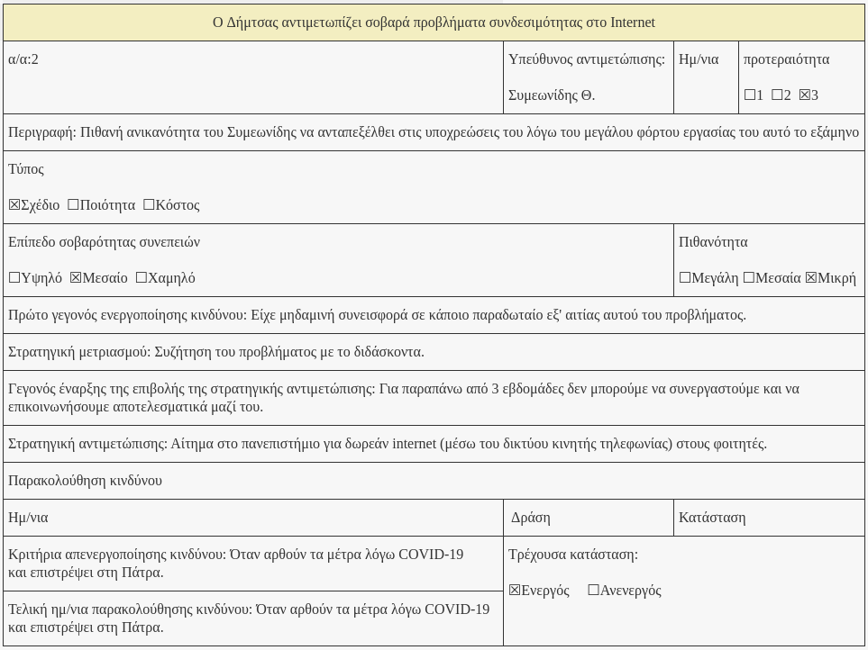

% Team Risk Assessment v0.1
% Move around
% 

\newpage

## Μέλη ομάδας
* Δήμτσας Γιάννης 1054423
* Μαντάς Ελευθέριος 1047128
* Ρούστας Κωνσταντίνος 1054422
* Συμεωνίδης Θεόδωρος 1064870

## Editor
* Θεόδωρος Συμεωνίδης 1064870

## Peer Reviewer

## Εργαλεία
Markdown, VSCode, GanttProject, Pandoc, Lightshot, [Table generator](https://www.tablesgenerator.com/)

\newpage

## Περιληπτικά
Η ομάδα μας δεν έχει συνεργαστεί αυτούσια στο παρελθόν, παρά μόνο επιμέρους μέλη της μεταξύ τους.
Η μεθοδολογία οργάνωσης της ομάδας μας (SCRUM) έχουμε διαβάσει πως δουλεύει ιδανικά όταν τα άτομα βρίσκονται σε καθημερινή φυσική επαφή
μεταξύ τους σε κάποιο κοινό φυσικό χώρο. Επειδή δεν είχαμε κοινό προσβάσιμο δικό μας φυσικό χώρο (π.χ. το σπίτι κάποιου μέλους) 
όπου θα γίνονταν τα meeting και θα υπήρχε και το board αποφασίστηκε αυτός να είναι το πανεπιστήμιο και το board να είναι online. Αυτό ήδη
αποτελεί ένα κίνδυνο ως παράφραση της μεθοδολογίας, ωστόσο κρίναμε ότι είναι το καλύτερο που μπορούμε να κάνουμε.

Με τις εξελίξεις περί COVID-19 που λαμβάνουν τόπο στη χώρα μας. Δύο από τα μέλη της ομάδας μας επέστρεψαν στη πόλη τους (εκτός Πατρών). Και τα meeting γίνονται
διαδικτυακά με τη βοήθεια του Discord και του Viber. Αυτό αυξάνει περισσότερο το κίνδυνο **μειωμένης παραγωγικότητας λόγω λάθους μεθοδολογίας οργάνωσης**.
Στη συγκεκριμένη περίπτωση ίσως θα έπρεπε να αλλάξουμε μεθοδολογία οργάνωσης και να επιλέξουμε μια που συνίσταται και για remote ομάδες (π.χ. Kanban).
Ωστόσο η ομάδα μας αποφάσισε να πάρει το ρίσκο και να συνεχίσει με αυτή τη μεθοδολογία.

Επίσης εκτεταμένη απομόνωση η οποία επιβάλλεται από την κυβέρνηση στους πολίτες και άρα και στα μέλη μας, η οποία πιθανολογείται πως θα συνεχιστεί 
και για κάποιους μήνες ακόμα εισάγει και **παράγοντες σχετικά με την ατομική μας υγεία** στη εξίσωση. Αρκεί μόνο να λάβουμε υπόψιν μας τις υπερβολικά εκτεταμένες ώρες χρήσης του υπολογιστή και τις καθιστικής ζωής που αυτή απαιτεί αλλά και την ένταση της κατάστασης που πιθανότατα θα έρθει με νέα μέτρα για τον αυστηρότερο περιορισμό της κυκλοφορίας (π.χ. απαγόρευση σωματικής άθλησης). Ωστόσο δεν πρέπει ξεχνάμε και τους ψυχολογικούς παράγοντες.

Σχετικά με επιμέρους κινδύνους του κάθε μέλους μας. Το μέλος μας **ο Συμεωνίδης, έχει μεγάλο φόρτο εργασίας αυτό το εξάμηνο**. Το μέλος μας **ο Δήμτσας**
που βρίσκεται εκτός Πατρών **αντιμετωπίζει σοβαρά προβλήματα συνδεσιμότητας στο Internet**.

## Συνοπτικά
* Γενικότεροι κίνδυνοι της ομάδας:
    * Μειωμένη παραγωγηκότητα λόγω λάθος μεθοδολογίας οργάνωσης
    * Ψυχολογική κατάστασης μελών κατά τη διάρκεια του COVID-19
* Επιμέρους κίνδυνοι κάθε μέλους:
    * ο Συμεωνίδης, έχει μεγάλο φόρτο εργασίας αυτό το εξάμηνο
    * o Δήμτσας αντιμετωπίζει σοβαρά προβλήματα συνδεσιμότητας στο Internet

## Φόρμες Καταγραφής Κινδύνων

\newpage

\newpage

