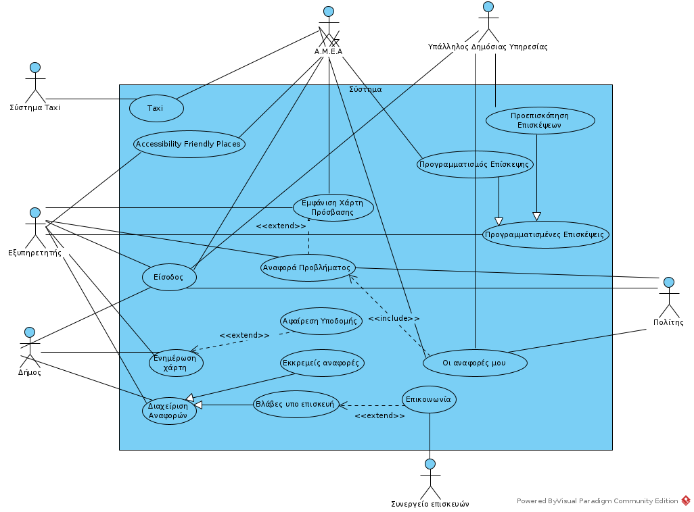

% Use Cases v0.1
% Move around
% 

\newpage

## Μέλη ομάδας
* Δήμτσας Γιάννης 1054423
* Μαντάς Ελευθέριος 1047128
* Ρούστας Κωνσταντίνος 1054422
* Συμεωνίδης Θεόδωρος 1064870

## Editor
* Δήμτσας Γιάννης 1054423
* Μαντάς Ελευθέριος 1047128
* Ρούστας Κωνσταντίνος 1054422
* Συμεωνίδης Θεόδωρος 1064870

## Peer Reviewer
* Δήμτσας Γιάννης 1054423
* Μαντάς Ελευθέριος 1047128
* Ρούστας Κωνσταντίνος 1054422
* Συμεωνίδης Θεόδωρος 1064870

## Εργαλεία
Markdown, VSCode, GanttProject, Pandoc, Lightshot, [Table generator](https://www.tablesgenerator.com/), [Mockflow](https://www.mockflow.com/), VisualParadigm, [Diagrams.net](https://app.diagrams.net/)

\newpage

--------------------------------------------------

### 1. Βασική Ροή "Αναφορά προβλήματος"
1. Ο χρήστης επιλέγει στη κύρια οθόνη "Αναφορά προβλήματος".
2. Το σύστημα εμφανίζει τον χάρτη.
3. Ο χρήστης επιλέγει τη τοποθεσία της βλάβης.
4. Το σύστημα εμφανίζει την οθόνη επιλογής φωτογραφίας.
5. Ο χρήστης επιλέγει τη φωτογραφία.
6. Το σύστημα εμφανίζει την οθόνη για την περιγραφή της βλάβης.
7. Ο χρήστης εισάγει τη περιγραφή και επιλέγει "Υποβολή Βλάβης".
8. Το σύστημα ενημερώνει την αναφορά και επιστρέφει στην αρχική οθόνη.

### Εναλλακτική Ροή 1
7.1. Ο χρήστης δεν έχει εισάγει περιγραφή.  
7.2. Το σύστημα εμφανίζει κατάλληλο μήνυμα προειδοποίησης και τον προτρέπει σε εισαγωγή.  
7.3. Ο χρήστης εισάγει περιγραφή.  
7.4. Η περίπτωση χρήσης συνεχίζει από το βήμα 8 της βασικής ροής.  

----------------------------------------------------

### 2. Βασική Ροή "Οι αναφορές μου"
1. Ο χρήστης επιλέγει στην κύρια οθόνη "Οι αναφορές μου".
2. Το σύστημα μεταβαίνει σε μια νέα οθόνη και εμφανίζει το ιστορικό του χρήστη με τις αναφορές που έχουν γίνει από αυτή τη συσκευή.
3. Ο χρήστης επιλέγει κάποια αναφορά για επεξεργασία.
4. Το σύστημα ελέγχει αν η αναφορά είναι σε κατάσταση εκκρεμότητας.
5. Το σύστημα εμφανίζει την οθόνη με τα στοιχεία της επιλεγμένης αναφοράς και δίνει της δυνατότητα επεξεργασίας τους.
6. Ο χρήστης επεξεργάζεται κάποια από τα πεδία της αναφοράς και επιλέγει "Αποθήκευση".
7. Το σύστημα ενημερώνει την αναφορά και επιστρέφει στην προηγούμενη οθόνη με το ιστορικό αναφορών.

### Εναλλακτική Ροή 1
4.1.1. Το σύστημα βρίσκει την αναφορά σε κατάσταση επιδιόρθωσης και ενημερώνει τον χρήστη με κατάλληλο μήνυμα.  
4.1.2. Το σύστημα επιστρέφει στην προηγούμενη οθόνη.  

### Εναλλακτική Ροή 2
4.2.1. Ο χρήστης επιλέγει διαγραφή της αναφοράς.  
4.2.2. Το σύστημα επιστρέφει στην προηγούμενη οθόνη.  

----------------------------------------------------------

### 3. Βασική ροή  "Εκκρεμείς Αναφορές"
1.	Ο υπάλληλος επιλέγει "Εκκρεμείς Αναφορές".
2.	Το σύστημα εμφανίζει όλες τις αναφορές που έχουν κάνει οι χρήστες.
3.	Ο υπάλληλος επιλέγει μία εκ των αναφορών πατώντας "Εξέταση Αναφοράς".
4.	Το σύστημα εμφανίζει τα στοιχεία της αναφοράς αυτής.
5.	Ο υπάλληλος αναφέρει τη βλάβη και επιλέγει "Αναφέρθηκε".
6.	Το σύστημα  ενημερώνει το χάρτη, αφαιρεί την συγκεκριμένη αναφορά από τις προς εξέταση αναφορές και την τοποθετεί στις υπό επισκευή.
7.	Ο υπάλληλος επιλέγει "Επιστροφή".
8.	Το σύστημα επιστρέφει τον υπάλληλο στην αρχική οθόνη.

### Εναλλακτική ροή
5.1.1. Ο υπάλληλος επιλέγει "Εξέταση Αργότερα".  
5.1.2. Το σύστημα τοποθετεί την αναφορά αυτή ξανά στις προς εξέταση αναφορές.  
5.1.3. Ο υπάλληλος πατάει "Επιστροφή".  
5.1.4. Το σύστημα επιστρέφει τον υπάλληλο στην αρχική οθόνη.  

----------------------------------------------------

### 4. Βασική ροή "Βλάβες υπό επισκευή"
1.	Ο υπάλληλος πατάει την επιλογή "Βλάβες υπό επισκευή".
2.	Το σύστημα εμφανίζει στην οθόνη όλες τις βλάβες που εξετάζονται.
3.	Ο υπάλληλος επιλέγει μία εκ των αναφορών πατώντας την "Εξέταση Αναφοράς".
4.	Το σύστημα εμφανίζει στην οθόνη τα στοιχεία της αναφοράς αυτής.
5.	Ο υπάλληλος επιλέγει "Επιλύθηκε".
6.	Το σύστημα αφαιρεί τη συγκεκριμένη αναφορά από τις υπό εξέταση αναφορές και ενημερώνει τον χάρτη.
7.	Ο υπάλληλος επιλέγει "Επιστροφή".
8.	Το σύστημα επιστρέφει τον υπάλληλο στην αρχική οθόνη.

### Εναλλακτική ροή
5.1.1. Ο υπάλληλος πατάει στο πεδίο "Επικοινωνία".  
5.1.2. Το σύστημα εμφανίζει στην οθόνη τα στοιχεία επικοινωνίας του συνεργείου που επιλέχθηκε για την επιδιόρθωση.  
5.1.3. Ο υπάλληλος επιλέγει "Επιστροφή".  
5.1.4. Το σύστημα επιστρέφει τον υπάλληλο στην αρχική οθόνη.  

----------------------------------------------------

### 5. Βασική ροή "Ενημέρωση Χάρτη"
1. Ο υπάλληλος πατάει την επιλογή "Δημιουργία Υποδομής".
2. Το σύστημα εμφανίζει την επιλογή να τοποθετήσει στίγμα στο χάρτη για κάποια νέα υποδομή που εγκαταστάθηκε.
3. Ο υπάλληλος επιλέγει το σημείο, δίνει έναν ορισμό και μία περιγραφή και επιλέγει "Αποθήκευση".
4. Το σύστημα καταχωρεί τη νέα υποδομή στο χάρτη και επιστρέφει τον υπάλληλο στην αρχική οθόνη.

### Εναλλακτική Ροή 1
1.1.1. Ο υπάλληλος πατάει την επιλογή "Αφαίρεση Υποδομής".  
1.1.2. Το σύστημα του εμφανίζει την επιλογή να αφαιρέσει κάποιο στίγμα από το χάρτη.  
1.1.3. Ο υπάλληλος επιλέγει το σημείο και επιλέγει τη "Διαγραφή και Αποθήκευση".  
1.1.4. Το σύστημα ενημερώνει κατάλληλα το χάρτη και επιστρέφει τον υπάλληλο στην αρχική οθόνη.  

### Εναλλακτική Ροή 2
3.1.1. Ο υπάλληλος έχει ξεχάσει να συμπληρώσει κάποιο πεδίο.  
3.1.2. Το σύστημα εμφανίζει κατάλληλο μήνυμα σφάλματος.  
3.1.3. Η περίπτωση χρήσης συνεχίζει από το βήμα 2 της βασικής ροής.  

-----------------------------------------------------

### 6. Βασική Ροή "Προεπισκόπηση Επισκέψεων":
1. Ο υπάλληλος πατάει την επιλογή "Προεπισκόπηση Επισκέψεων".
2. Το σύστημα εμφανίζει όλες τις επισκέψεις που έχουν προγραμματιστεί για κάθε μέρα.
3. Ο υπάλληλος επιλέγει μια επίσκεψη πατώντας "Εξέταση".
4. Το σύστημα εμφανίζει τα στοιχεία επικοινωνίας του Α.Μ.Ε.Α. και ενημερώνει τον υπάλληλο εγκαίρως για την ώρα άφιξης του Α.Μ.Ε.Α..
5. Ο υπάλληλος αφού ολοκληρωθεί η επίσκεψη επιλέγει "Ολοκληρώθηκε".
6. Το σύστημα αφαιρεί την επίσκεψη από το σύνολο των επισκέψεων και επιστρέφει τον υπάλληλο στην αρχική σελίδα.

### Εναλλακτική Ροή 1
3.1.1. Ο υπάλληλος κάνει προεπισκόπηση την αίτησης.  
3.1.2. Ο υπάλληλος πατάει "Έξοδος".  
3.1.3. Η περίπτωση χρήσης συνεχίζεται από το βήμα 3 της βασικής ροής.

----------------------------------------------------

### 7. Βασική Ροή "Προγραμματισμός Επίσκεψης"
1. Ο χρήστης επιλέγει στην κύρια οθόνη την "Προγραμματισμός Επίσκεψης".
2. Το σύστημα εμφανίζει στον χρήστη τη φόρμα επικοινωνίας που πρέπει να συμπληρώσει ο χρήστης.
3. Ο χρήστης εισάγει το ονοματεπώνυμο του και την δημόσια υπηρεσία που πρόκειται να επισκεφτεί και επιβεβαιώνει.
4. Το σύστημα ζητάει την ημερομηνία και την ώρα της επίσκεψης.
5. Ο χρήστης συμπληρώνει τα απαιτούμενα στοιχεία για την επίσκεψη.
6. Το σύστημα ελέγχει την εγκυρότητα και τη διαθεσιμότητα της επιλεγμένης ημερομηνίας και ώρας και δίνει τη δυνατότητα για "Επιβεβαίωση".
7. Το σύστημα αποστέλει την προγραμματισμένη επίσκεψη στην κατάλληλη υπηρεσία και επιστρέφει το χρήστη στην αρχική οθόνη.

### Εναλλακτική Ροή 1
5.1.1 Το σύστημα διαπιστώνει ότι ο χρήστης έχει επιλέξει επικαλυπτόμενη ημερομηνία και ώρα.  
5.1.2 Το σύστημα εμφανίζει το μήνυμα "Επιλέξατε επικαλυπτόμενη ημερομηνία και ώρα. Παρακαλώ ξαναπρογραμματίστε τη συνάντησή σας."  
5.1.3 Η περίπτωση χρήσης συνεχίζεται από το Βήμα 5 της Βασικής Ροής.

### Εναλλακτική Ροή 2
5.2.1 Το σύστημα διαπιστώνει ότι ο χρήστης έχει επιλέξει ημερομηνία και ώρα μη λειτουργίας της υπηρεσίας.  
5.2.2 Το σύστημα εμφανίζει το μήνυμα "Η υπηρεσία είναι εκτός λειτουργίας την ώρα ή/και ημερομηνία που επιλέξατε".  
5.2.3 Η περίπτωση χρήσης συνεχίζεται από το Βήμα 5 της Βασικής Ροής.  

----------------------------------------------------

### 8. Βασική Ροή "Εμφάνιση Χάρτη Πρόσβασης"
1. Ο χρήστης επιλέγει στην κύρια οθόνη "Εμφάνιση Χάρτη Πρόσβασης".
2. Το σύστημα εμφανίζει τον χάρτη της περιοχής και την τοποθεσία του χρήστη.
3. Ο χρήστης επιλέγει το φίλτρο χάρτη "Εμπόδια".
4. Το σύστημα εμφανίζει στο χάρτη τα εμπόδια που πιθανόν να δυσκολέψουν την κινητικότητα Α.Μ.Ε.Α. στην κοντινή περιοχή.
5. Ο χρήστης πατάει "Ολοκληρώθηκε".
6. To σύστημα δίνει τη δυνατότητα αναφοράς προβλήματος στο χρήστη.
7. Ο χρήστης επιλέγει το πλήκτρο "Έξοδος".  
8. Το σύστημα μεταφέρει τον χρήστη στην αρχική οθόνη του συστήματος.

### Εναλλακτική Ροή 1
3.1.1 O χρήστης επιλέγει το φίλτρο "Τουαλέτες".  
3.1.2 Το σύστημα εμφανίζει στο χάρτη τις τουαλέτες για Α.Μ.Ε.Α. της κοντινής περιοχής.  
3.1.3 Ο χρήστης πατάει επιβεβαίωση και η περίπτωση χρήσης συνεχίζεται από το βήμα 3 της Βασικής Ροής.  

### Εναλλακτική Ροή 2
3.2.1 O χρήστης επιλέγει το φίλτρο "Parkings".  
3.2.2 Το σύστημα εμφανίζει στο χάρτη τα parking για Α.Μ.Ε.Α. της κοντινής περιοχής.  
3.2.3 Ο χρήστης πατάει επιβεβαίωση και η περίπτωση χρήσης συνεχίζεται από το βήμα 3 της Βασικής Ροής.  

### Εναλλακτική Ροή 3  
6.1.1 Ο χρήστης επιλέγει το πλήκτρο "Αναφορά Προβλήματος".  
6.1.2 Το σύστημα μεταφέρει τον χρήστη στην οθόνη περίπτωσης χρήσης "Αναφορά Προβλήματος".

----------------------------------------------------

### 9. Βασική ροή "Accessibility Friendly Places"
1. Ο χρήστης πατάει την επιλογή "Accessibility Friendly Places".
2. Το σύστημα εμφανίζει όλες τις προτάσεις άλλων χρηστών για χώρους με προδιαγραφές για πρόσβαση Α.Μ.Ε.Α. .
3. Ο χρήστης πατάει την επιλογή "Προσθήκη πρότασης".
4. Το σύστημα επιτρέπει την υποβολή τοποθεσίας και κριτικής ενός χώρου.
5. Ο χρήστης συμπληρώνει όλα τα πεδία που απαιτούνται για την υποβολή της πρότασης και πατάει "Υποβολή πρότασης".
6. Το σύστημα αποθηκεύει τη πρόταση και τη τοποθετεί με τις υπόλοιπες υπάρχουσες προτάσεις άλλων χρηστών.
7. To σύστημα επιστρέφει τον χρήστη στην αρχική οθόνη του συστήματος.

### Εναλλακτική Ροή 1
<<<<<<< HEAD
3.1.1. Ο χρήστης επιλέγει μία εξ’ αυτών πατώντας "Προεπισκόπηση".
3.1.2. Το σύστημα εμφανίζει την πρόταση με τα στοιχεία της.
3.1.3. Ο χρήστης αφού εξετάσει τη πρόταση επιλέγει "Like".
3.1.4. Ο χρήστης επιλέγει "Επιστροφή".
3.1.5. Το σύστημα τον επιστρέφει στη λίστα με τις προτάσεις.
=======
3.1.1. Ο χρήστης επιλέγει μία εξ’ αυτών πατώντας πάνω της.  
3.1.2. Το σύστημα εμφανίζει την κριτική και την τοποθεσία της πρότασης αυτής.  
3.1.3. Ο χρήστης αφού εξετάσει τη πρόταση επιλέγει "Like".  
3.1.4. Ο χρήστης επιλέγει "Επιστροφή".  
3.1.5. Το σύστημα τον επιστρέφει στη λίστα με τις προτάσεις.  
>>>>>>> 933dadb3fc041be93684ec4dea9d4f140f1ed7be

### Εναλλακτική ροή 2
3.1.1 Ο χρήστης επεξεργάζεται μία πρόταση εφ'όσον την έχει δημιουργήσει ο ίδιος, επιλέγοντας "Επεξεργασία"
3.1.2 Το σύστημα εμφανίζει την πρόταση και τα στοιχεία της.  
3.1.3 Ο χρήστης επιλέγει "Αλλαγή Κριτικής", επεξεργάζεται την υπάρχουσα κριτική και πατάει "Αποθήκευση".  
3.1.4 Το σύστημα αποθηκεύει τη πρόταση όπως προέκυψε μετά την αλλαγή.  
3.1.5 Η περίπτωση χρήσης συνεχίζει από το Βήμα 3 της Βασικής Ροής.

### Εναλλακτική Ροή 3
3.2.1 Ο χρήστης διαγράφει μία πρόταση εφ'όσον την έχει δημιουργήσει ο ίδιος, επιλέγοντας "Διαγραφή".
3.2.2 Το σύστημα ενημερώνει τη λίστα με τις προτάσεις.  
3.2.3 Η περίπτωση χρήσης συνεχίζει από το Βήμα 3 της Βασικής Ροής.  

----------------------------------------------------

### 10. Βασική ροή "TAXI"
1. Ο χρήστης επιλέγει "TAXI".
2. Το σύστημα εμφανίζει την τοποθεσία του χρήστη στον χάρτη.
3. Ο χρήστης επιβεβαιώνει την τοποθεσία του.
4. Το σύστημα ζητάει τα στοιχεία του χρήστη και τον προορισμό του.
5. Ο χρήστης συμπληρώνει και πατάει "Oλοκλήρωση".
6. Το σύστημα επιβεβαιώνει την κράτηση και εμφανίζει χρόνο αναμονής. Στέλνει τον χρήστη στην αρχική οθόνη.

### Εναλλακτική ροή 1
3.1.1 Ο χρήστης δεν επιβεβαιώνει την τοποθεσία του.  
3.1.2 Το σύστημα εμφανίζει κάποιο πεδίο για εισαγωγή της τοποθεσίας του.  
3.1.3 Ο χρήστης συμπληρώνει την τοποθεσία του ολογράφως και πατάει "ολοκλήρωση".  
3.1.4 Το σύστημα επιστρέφει στην βασική ροή στο βήμα 4.

\newpage

## Διάγραμμα Use Cases
