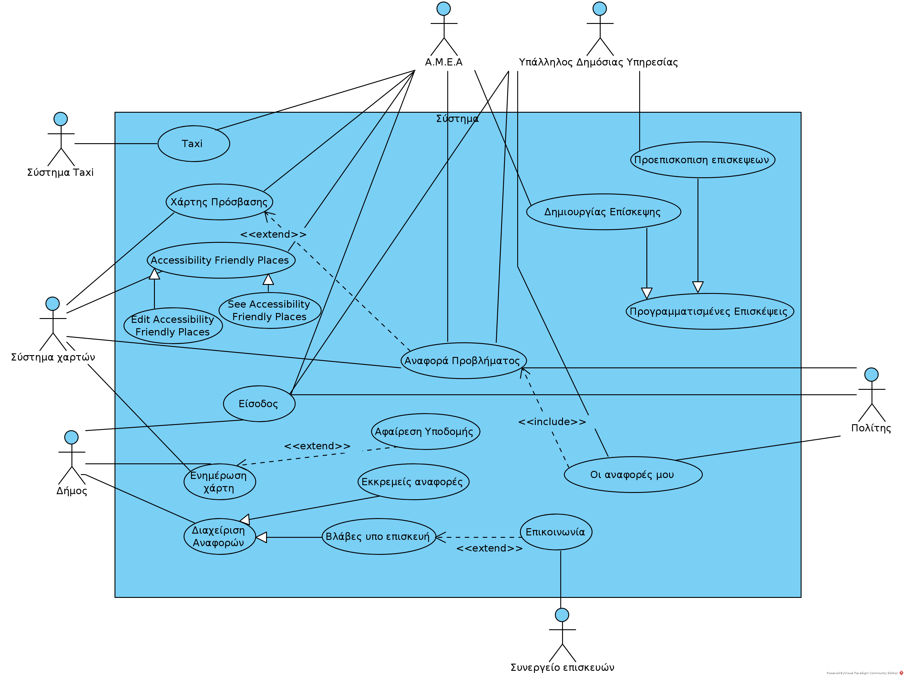

% Use Cases v0.3
% Move around
% 

\newpage

## Μέλη ομάδας
* Δήμτσας Γιάννης 1054423
* Μαντάς Ελευθέριος 1047128
* Ρούστας Κωνσταντίνος 1054422
* Συμεωνίδης Θεόδωρος 1064870

## Editor
* Δήμτσας Γιάννης 1054423
* Μαντάς Ελευθέριος 1047128
* Ρούστας Κωνσταντίνος 1054422
* Συμεωνίδης Θεόδωρος 1064870

## Peer Reviewer
* Δήμτσας Γιάννης 1054423
* Μαντάς Ελευθέριος 1047128
* Ρούστας Κωνσταντίνος 1054422
* Συμεωνίδης Θεόδωρος 1064870

## Εργαλεία
Markdown, VSCode, GanttProject, Pandoc, Lightshot, [Table generator](https://www.tablesgenerator.com/), [Mockflow](https://www.mockflow.com/), VisualParadigm, [Diagrams.net](https://app.diagrams.net/)

\newpage

## Changelog
### v0.2
* Προσθήκη αρίθμησης στα use cases.
* Use case 2, 7, 10 : Μικρές αλλαγές στην σύνταξη.
* Use case 3, 4, 5 : Ολική ανασύνταξη μετά από την δημιουργία του αντίστοιχου Robustness-Diagram και την ανανέωση του Domain-model.
* Use case 6 : Προσθήκη εναλλακτικής ροής 2 και μικρές διορθώσεις στη σύνταξη.
* Use case 8 : Μικρές αλλαγές στη σύνταξη και αλλαγή στην ακολουθία των βημάτων
* Use case 9 : Αλλαγή της βασικής ροής με την εναλλακτική ροή 1 και μικρές αλλαγές στη σύνταξη.

## Changelog
### v0.3
Οι σημαντικές αλλαγές από το v0.2 στο v0.3 έχουν υπογραμμιστεί με \textcolor{blue}{μπλέ} χρώμα.

* Use case 2: Εμπλουτισμός του βήματος 8 ώστε να προσθέτει την αναφορά προβλήματος στη λίστα με τις Βλάβες υπό Επισκευή του Δήμου καθώς και στην Αναφορές του χρήστη.
* Use Case 3: Η εναλλακτική ροή είχε τοποθετηθεί λανθασμένα στο βήμα 5, ενώ ήταν στο 7ο.
* Use Case 1-7-9: Μικρές αλλαγές στα λάθη της αρίθμησης.
* Use Case 9: Οι εναλλακτικές ροές επιστρέφουν το χρήστη στην αρχική οθόνη του συστήματος.

## Changelog
### v0.4
* Use Case 3: Στο βήμα 6 της βασικής ροής προστέθηκε η περιγραφή πως το σύστημα ανακτά την συγκεκριμένη αναφορά από τις Pending Issues και τα δεδομένα της από τη κλάση ReportIssue.
* Use Case 4: Στο βήμα 5 της βασικής ροής προστέθηκε η περιγραφή πως το σύστημα ανακτά την συγκεκριμένη αναφορά από τις Under Construction Issues και τα δεδομένα της από τη κλάση ReportIssue.
* Use Case 5: Τα βήματα 5,6 του use case διασπάστηκαν σε 4 βήματα: 5,6,7,8. Έτσι ο υπάλληλος πρώτα επιλέγει μία τοποθεσία στο χάρτη και το σύστημα ελέγχει αυτή την επιλογή και ύστερα συμπληρώνει τα πεδία των δεδομένων και το σύστημα ελέγχει και αυτή την επιλογή. Αντίστοιχα δημιουργήθηκαν δύο εναλλακτικές ροές σε περίπτωση λάθους προσθήκης τοποθεσίας και δεδομένων αντίστοιχα. Επίσης στην εναλλακτική ροή 2 το βήμα εμφάνισης μηνύματος προειδοποίησης αφαιρέθηκε.
* Use Case 6: Στο βήμα 2 της βασικής ροής προστέθηκε η περιγραφή πως το σύστημα ανακτά τις προγραμματισμένες επισκέψεις από τον κατάλογο "Προγραμματισμένες Επισκέψεις". Στο βήμα 4 της βασικής ροής προστέθηκε η περιγραφή πως το σύστημα ανακτά τα στοιχεία του ΑΜΕΑ από τον κατάλογο "Επίσκεψη".
* Use Case 7: Οι δύο εναλλακτικές ροές άλλαξαν θέση. Προστέθηκαν λεπτομέρειες στα βήματα της βασικής ροής και ένα επιπλέον βήμα, ώστε να συνάδουν με τα αντίστοιχα robustness - sequence diagrams.
* Use Case 8: Αλλαγές στην αρίθμηση της εναλλακτικής ροής 3(ξεκινάει από το βήμα 7). Μικρές αλλαγές στην έκφραση. Οι εναλλακτικές ροές πλέον συνεχίζουν από το βήμα 6.
* Use Case 9: Διασπάστηκε σε Use Case 9 () και Use Case 10(). To Use Case 9 περιέχει την επιλογή "Like" και την προσθήκη πρότασης AFP ενώ το Use Case 10 περιέχει την τροποποίηση πρότασης AFP και τη διαγραφή πρότασης AFP. Οι δύο τελευταίες εναλλακτικές ροές έγιναν νέο Use Case.
* Use Case 10: Αλλαγή αρίθμησης του Use Case από 10 σε 11.

\newpage
--------------------------------------------------

### 1. Βασική Ροή "Αναφορά προβλήματος"
1. Ο χρήστης επιλέγει στη κύρια οθόνη "Αναφορά προβλήματος".
2. Το σύστημα εμφανίζει τον χάρτη.
3. Ο χρήστης επιλέγει τη τοποθεσία της βλάβης.
4. Το σύστημα εμφανίζει την οθόνη επιλογής φωτογραφίας.
5. Ο χρήστης επιλέγει τη φωτογραφία.
6. Το σύστημα εμφανίζει την οθόνη για την περιγραφή της βλάβης.
7. Ο χρήστης εισάγει τη περιγραφή και επιλέγει "Υποβολή Βλάβης".
8. Το σύστημα \textcolor{blue}{δημιουργεί} την αναφορά, \textcolor{blue}{την βάζει στις "Βλάβες υπό Επισκευή" 
και στο ιστορικό αναφορών του χρήστη} και επιστρέφει στην αρχική οθόνη.

### Εναλλακτική Ροή 1
7.1.1 Ο χρήστης δεν έχει εισάγει περιγραφή.  
7.1.2 Το σύστημα εμφανίζει κατάλληλο μήνυμα προειδοποίησης και τον προτρέπει σε εισαγωγή.  
7.1.3 Ο χρήστης εισάγει περιγραφή.  
7.1.4 Η περίπτωση χρήσης συνεχίζει από το βήμα 8 της βασικής ροής.  

----------------------------------------------------

### 2. Βασική Ροή "Οι αναφορές μου"
1. Ο χρήστης επιλέγει στην κύρια οθόνη "Οι αναφορές μου".
2. Το σύστημα μεταβαίνει σε μια νέα οθόνη και εμφανίζει το ιστορικό του χρήστη με τις αναφορές που έχουν γίνει από αυτόν τον χρήστη.
3. Ο χρήστης επιλέγει κάποια αναφορά για επεξεργασία.
4. Το σύστημα ελέγχει αν η αναφορά είναι σε κατάσταση εκκρεμότητας.
5. Το σύστημα εμφανίζει την οθόνη με τα στοιχεία της επιλεγμένης αναφοράς και δίνει της δυνατότητα επεξεργασίας τους.
6. Ο χρήστης επεξεργάζεται κάποια από τα πεδία της αναφοράς και επιλέγει "Αποθήκευση".
7. Το σύστημα ενημερώνει την αναφορά και επιστρέφει στην προηγούμενη οθόνη με το ιστορικό αναφορών.

### Εναλλακτική Ροή 1
4.1.1. Το σύστημα βρίσκει την αναφορά σε κατάσταση επιδιόρθωσης και ενημερώνει τον χρήστη με κατάλληλο μήνυμα.  
4.1.2. Το σύστημα επιστρέφει στην προηγούμενη οθόνη.  

### Εναλλακτική Ροή 2
4.2.1. Ο χρήστης επιλέγει διαγραφή της αναφοράς.  
4.2.2. Το σύστημα επιστρέφει στην προηγούμενη οθόνη.  

----------------------------------------------------------

### 3. Βασική ροή  "Εκκρεμείς Αναφορές"
1. Ο υπάλληλος του Δήμου επιλέγει στη κύρια οθόνη "Διαχείριση Αναφορών".
2. Το σύστημα εμφανίζει την οθόνη Διαχείρισης Αναφορών.
3. Ο υπάλληλος του Δήμου επιλέγει "Εκκρεμείς Αναφορές".
4. Το σύστημα ανακτά όλες τις αναφορές που έχουν κάνει οι χρήστες από τις Pending Issues και εμφανίζει την οθόνη "Εκκρεμείς Αναφορές".
5. Ο υπάλληλος του Δήμου επιλέγει μία εκ των αναφορών πατώντας "Εξέταση Αναφοράς".
6. Το σύστημα \textcolor{blue}{επιλέγει την συγκεκριμένη αναφορά από τις Pending Issues, ανακτά τα δεδομένα της ReportIssue και τα εμφανίζει την οθόνη στοιχείων αναφοράς}.
7. Ο υπάλληλος του Δήμου επιλέγει "Αναφέρθηκε".
8. Το σύστημα ενημερώνει το Χάρτη Πρόσβασης, τις Pending Issues και τις Under Construction Issues και επιστρέφει τον υπάλληλο του Δήμου στην κύρια οθόνη.

### Εναλλακτική ροή:
\textcolor{blue}{7.1.1.} Ο υπάλληλος του Δήμου επιλέγει "Εξέταση Αργότερα".
\textcolor{blue}{7.1.2.} Το σύστημα τοποθετεί την αναφορά αυτή ξανά στις Pending Issues και επιστρέφει τον υπάλληλο του Δήμου στην κύρια οθόνη.  

----------------------------------------------------

### 4. Βασική ροή "Βλάβες υπό επισκευή"
1. Ο υπάλληλος του Δήμου επιλέγει στη κύρια οθόνη "Διαχείριση Αναφορών".
2. Το σύστημα εμφανίζει την οθόνη Διαχείρισης αναφορών.
3. Ο υπάλληλος του Δήμου επιλέγει "Βλάβες υπό Επισκευή".
4. Το σύστημα ανακτά όλες τις αναφορές που έχουν κάνει οι χρήστες από τις Under Construction Issues και εμφανίζει την οθόνη "Βλάβες Υπό Επισκευή".
4. Ο υπάλληλος του Δήμου επιλέγει μία εκ των αναφορών πατώντας την "Εξέταση Αναφοράς".
5. Το σύστημα \textcolor{blue}{επιλέγει την συγκεκριμένη αναφορά από τις Under Construction Issues, ανακτά τα δεδομένα της ReportIssue και τα εμφανίζει την οθόνη στοιχείων αναφοράς}.
6. Ο υπάλληλος του Δήμου επιλέγει "Επιλύθηκε".
7. Το σύστημα αφαιρεί την αναφορά από τις Under Construction Issues, ενημερώνει το Χάρτη Πρόσβασης και επιστρέφει τον υπάλληλο του Δήμου στην κύρια οθόνη.

### Εναλλακτική ροή

6.1.1. Ο υπάλληλος του Δήμου πατάει στο πεδίο "Επικοινωνία".  
6.1.2. Το σύστημα ανακτά όλα τα συνεργεία από το Service Info και εμφανίζει την οθόνη των στοιχείων επικοινωνίας των συνεργείων.  
6.1.3. Ο υπάλληλος του Δήμου επιλέγει "Επιστροφή".  
6.1.4. Το σύστημα επιστρέφει τον υπάλληλο στην κύρια οθόνη.  

----------------------------------------------------

### 5. Βασική ροή "Ενημέρωση Χάρτη"
1. Ο υπάλληλος του Δήμου επιλέγει στη κύρια οθόνη  "Ενημέρωση Χάρτη".
2. Το σύστημα εμφανίζει την οθόνη Ενημέρωσης Χάρτη.
3. Ο υπάλληλος του Δήμου επιλέγει "Δημιουργία Υποδομής".
4. Το σύστημα εμφανίζει την οθόνη "Δημιουργία Υποδομής".  
\textcolor{blue}{5.} Ο υπάλληλος του Δήμου επιλέγει μία τοποθεσία στο χάρτη.  
\textcolor{blue}{6.} Το σύστημα ελέγχει αν ο υπάλληλος του Δήμου επέλεξε τοποθεσία στο χάρτη και εμφανίζει την οθόνη συμπλήρωσης  στοιχείων.  
\textcolor{blue}{7.} Ο υπάλληλος του Δήμου συμπληρώνει έναν ορισμό και μία περιγραφή.  
\textcolor{blue}{8.} Το σύστημα ελέγχει αν ο υπάλληλος συμπλήρωσε ορισμό και περιγραφή και εμφανίζει την οθόνη επιβεβαίωσης.  
9. Ο υπάλληλος του Δήμου επιλέγει "Αποθήκευση".
10. Το σύστημα αποθηκεύει τη νέα υποδομή στο σύνολο των στιγμάτων και επιστρέφει τον υπάλληλο του Δήμου στην κύρια οθόνη.

### Εναλλακτική Ροή 1
3.1.1. Ο υπάλληλος του Δήμου πατάει την επιλογή "Αφαίρεση Υποδομής".  
3.1.2. Το σύστημα εμφανίζει την οθόνη "Αφαίρεση Υποδομής".  
3.1.3. Ο υπάλληλος του Δήμου επιλέγει τη τοποθεσία της υποδομής και επιλέγει τη "Διαγραφή και Αποθήκευση".  
3.1.4. Το σύστημα διαγράφει τη ζητούμενη τοποθεσία από το σύνολο και επιστρέφει τον υπάλληλο στην κύρια οθόνη.  

### Εναλλακτική Ροή 2
5.1.1. Ο υπάλληλος του Δήμου επιλέγει "Ακύρωση Διαδικασίας".  
5.1.2. Το σύστημα επιστρέφει τον υπάλληλος στον κύρια οθόνη. 

### Εναλλακτικη Ροή 3
\textcolor{blue}{5.2.1.} Ο υπάλληλος του Δήμου επιλέγει σημείο στο χάρτη όπου ήδη υπάρχει.  
\textcolor{blue}{5.2.2.} Το σύστημα προειδοποιεί με κατάλληλο μήνυμα και επιστρέφει στην οθόνη Δημιουργίας Υποδομής.

### Εναλλακτικη Ροή 4
\textcolor{blue}{7.1.1.} Ο υπάλληλος του Δήμου δεν συμπληρώνει όλα τα στοιχεία που απαιτούνται.  
\textcolor{blue}{7.1.2.} Το σύστημα προειδοποιεί με κατάλληλο μήνυμα και επιστρέφει στην οθόνη Δημιουργίας Υποδομής.  

-----------------------------------------------------

### 6. Βασική Ροή "Προεπισκόπηση Επισκέψεων":
1. Ο υπάλληλος πατάει την επιλογή "Προεπισκόπηση Επισκέψεων".
2. Το σύστημα ανακτά όλες τις επισκέψεις που έχουν προγραμματιστεί για την υπηρεσία του, από τον κατάλογο "Προγραμματισμένες επισκέψεις" και τις εμφανίζει στην οθόνη "Προεπισκόπιση Επισκέψεων".
3. Ο υπάλληλος επιλέγει μια επίσκεψη πατώντας "Εξέταση".
4. Το σύστημα ανακτάει τα στοιχεία επικοινωνίας του Α.Μ.Ε.Α. από τον κατάλογο "Επίσκεψη", τα εμφανίζει στην οθόνη "Στοιχεία/Ώρα Επίσκεψης" και ενημερώνει τον υπάλληλο για την ώρα άφιξης του Α.Μ.Ε.Α..
5. Ο υπάλληλος αφού ολοκληρωθεί η επίσκεψη επιλέγει "Ολοκληρώθηκε".
6. Το σύστημα αφαιρεί την επίσκεψη από τον κατάλογο "Πογραμματισμένες Επισκέψεις" και επιστρέφει τον υπάλληλο στην κύρια οθόνη.

### Εναλλακτική Ροή 1
5.1.1. Ο υπάλληλος ενημερώνεται για την αίτηση και επιλέγει “Επιστροφή”.  
5.1.2. Το σύστημα επιστρέφει τον υπάλληλο στην οθόνη “Προεπισκόπηση επισκέψεων”.  

### Εναλλακτική Ροή 2 
5.2.1. Ο υπάλληλος κάνει προεπισκόπηση την αίτησης και επιλέγει “Ακύρωση Διαδικασίας”.  
5.2.2. Το σύστημα διαγράφει την αίτηση από τον κατάλογο "Προγραμματισμένες Επισκέψεις" και επιστρέφει τον υπάλληλο στην κύρια οθόνη.  

----------------------------------------------------

### 7. Βασική Ροή "Προγραμματισμός Επίσκεψης"
1. Ο χρήστης επιλέγει στην κύρια οθόνη την "Προγραμματισμός Επίσκεψης".
2. Το σύστημα εμφανίζει στον χρήστη τη φόρμα επικοινωνίας που πρέπει να συμπληρώσει ο χρήστης \textcolor{blue}{και δημιουργεί μία νέα επίσκεψη.}
3. Ο χρήστης εισάγει το ονοματεπώνυμο του και την δημόσια υπηρεσία που πρόκειται να επισκεφτεί και επιβεβαιώνει.
4. Το σύστημα \textcolor{blue}{προσθέτει τα στοιχεία στην επίσκεψη, εμφανίζει την οθόνη επιλογής ημερομηνίας και ώρας και ζητάει τα απαιτούμενα πεδία από τον χρήστη.}
5. Ο χρήστης συμπληρώνει τα απαιτούμενα στοιχεία για την επίσκεψη.
6. Το σύστημα \textcolor{blue}{ελέγχει τη διαθεσιμότητα της υπηρεσίας, ελέγχει αν η επίσκεψη επικαλύπτεται και εμφανίζει την προεπισκόπηση της επίσκεψης.}
7. \textcolor{blue}{Ο χρήστης επιβεβαιώνει την επίσκεψη.}
8. Το σύστημα \textcolor{blue}{προσθέτει την προγραμματισμένη επίσκεψη στην λίστα της κατάλληλης υπηρεσίας} και επιστρέφει το χρήστη στην αρχική οθόνη.

### Εναλλακτική Ροή 1
6.1.1. Το σύστημα διαπιστώνει ότι ο χρήστης έχει επιλέξει ημερομηνία και ώρα μη λειτουργίας της υπηρεσίας.  
6.1.2. Το σύστημα εμφανίζει το μήνυμα προειδοποίησης μη λειτουργίας της υπηρεσίας.  
6.1.3. Η περίπτωση χρήσης συνεχίζεται από το Βήμα 5 της Βασικής Ροής.  

### Εναλλακτική Ροή 2
6.2.1. Το σύστημα διαπιστώνει ότι ο χρήστης έχει επιλέξει επικαλυπτόμενη ημερομηνία και ώρα.  
6.2.2. Το σύστημα εμφανίζει το μήνυμα προειδοποίησης ότι υπάρχει άλλη προγραμματισμένη επίσκεψη εκείνη την ώρα.  
6.2.3. Η περίπτωση χρήσης συνεχίζεται από το Βήμα 5 της Βασικής Ροής.  

----------------------------------------------------

### 8. Βασική Ροή "Εμφάνιση Χάρτη Πρόσβασης"
1. Ο χρήστης επιλέγει στην κύρια οθόνη "Εμφάνιση Χάρτη Πρόσβασης".
2. Το σύστημα εμφανίζει τον χάρτη της περιοχής και την τοποθεσία του χρήστη.
3. Ο χρήστης επιλέγει το φίλτρο χάρτη "Εμπόδια".
4. Το σύστημα εμφανίζει στο χάρτη τις τοποθεσίες με τα εμπόδια που πιθανόν να δυσκολέψουν την κινητικότητα Α.Μ.Ε.Α. στην κοντινή περιοχή.
5. Ο χρήστης πατάει "Ολοκληρώθηκε".
6. To σύστημα  εμφανίζει μήνυμα και δίνει τη δυνατότητα αναφοράς προβλήματος στο χρήστη.
7. Ο χρήστης επιλέγει το πλήκτρο "Έξοδος".
8. Το σύστημα μεταφέρει τον χρήστη στην αρχική οθόνη του συστήματος.

### Εναλλακτική Ροή 1
3.1.1. O χρήστης επιλέγει το φίλτρο "Τουαλέτες".  
3.1.2. Το σύστημα εμφανίζει στο χάρτη τις τοποθεσίες με τουαλέτες για Α.Μ.Ε.Α. της κοντινής περιοχής.  
3.1.3. Ο χρήστης πατάει \textcolor{blue}{"Ολοκληρώθηκε"} και η περίπτωση χρήσης συνεχίζεται από το \textcolor{blue}{βήμα 6} της Βασικής Ροής.  

### Εναλλακτική Ροή 2
3.2.1. O χρήστης επιλέγει το φίλτρο "Parkings".  
3.2.2. Το σύστημα εμφανίζει στο χάρτη τις τοποθεσίες με parking για Α.Μ.Ε.Α. της κοντινής περιοχής.  
3.2.3. Ο χρήστης πατάει \textcolor{blue}{"Ολοκληρώθηκε"} και η περίπτωση χρήσης συνεχίζεται από το \textcolor{blue}{βήμα 6} της Βασικής Ροής.  

### Εναλλακτική Ροή 3  
\textcolor{blue}{7.1.1.} Ο χρήστης επιλέγει το πλήκτρο "Αναφορά Προβλήματος".  
\textcolor{blue}{7.1.2.} Το σύστημα μεταφέρει τον χρήστη στην οθόνη περίπτωσης χρήσης "Αναφορά Προβλήματος".  

----------------------------------------------------

### 9. Βασική ροή "See Accessibility Friendly Places"
1. Ο χρήστης πατάει την επιλογή "See Accessibility Friendly Places".
2. Το σύστημα εμφανίζει μια νέα οθόνη με όλες τις προτάσεις άλλων χρηστών για χώρους με προδιαγραφές για πρόσβαση Α.Μ.Ε.Α. .
3. Ο χρήστης πατάει την επιλογή "Προσθήκη πρότασης".
4. Το σύστημα εμφανίζει νέα οθόνη και επιτρέπει την υποβολή τοποθεσίας και κριτικής ενός χώρου.
5. Ο χρήστης συμπληρώνει την τοποθεσία και την κριτική που απαιτούνται για την υποβολή της πρότασης και πατάει "Υποβολή πρότασης".
6. Το σύστημα προσθέτει τα στοιχεία στην πρόταση και τη τοποθετεί με τις υπόλοιπες υπάρχουσες προτάσεις άλλων χρηστών.
7. To σύστημα επιστρέφει τον χρήστη στην αρχική οθόνη του συστήματος.

### Εναλλακτική Ροή 1
3.1.1. Ο χρήστης επιλέγει μία εξ’ αυτών πατώντας "Προεπισκόπηση".  
3.1.2. Το σύστημα \textcolor{blue}{εμφανίζει σε μια νέα οθόνη την πρόταση με τα στοιχεία της.}  
3.1.3. Ο χρήστης αφού εξετάσει τη πρόταση επιλέγει "Like".  
3.1.4. Το σύστημα προσθέτει την πρόταση στη λίστα με τις αγαπημένες του προτάσεις.  
3.1.5. Ο χρήστης επιλέγει "Επιστροφή" και η περίπτωση χρήσης συνεχίζεται από το βήμα 2 της βασικής ροής.  

----------------------------------------------------

### 10. Βασική ροή "Edit Accessibility Friendly Places"
1. Ο χρήστης πατάει την επιλογή "Edit Accessibility Friendly Places".
2. Το σύστημα εμφανίζει μια νέα οθόνη με όλες τις προτάσεις του χρήστη για χώρους με προδιαγραφές για πρόσβαση Α.Μ.Ε.Α. .
3. Ο χρήστης επεξεργάζεται μία πρόταση επιλέγοντας "Επεξεργασία".  
4. Το σύστημα εμφανίζει μια οθόνη με την πρόταση και τα στοιχεία της.  
5. Ο χρήστης επιλέγει "Αλλαγή Κριτικής", επεξεργάζεται την υπάρχουσα κριτική και πατάει "Αποθήκευση".  
6. Το σύστημα αποθηκεύει τη πρόταση όπως προέκυψε μετά την αλλαγή.  
7. To σύστημα επιστρέφει το χρήστη στην αρχική οθόνη του συστήματος.   

### Εναλλακτική Ροή 1
3.3.1. Ο χρήστης διαγράφει μία πρόταση επιλέγοντας "Διαγραφή".  
3.3.2. Το σύστημα ενημερώνει τη λίστα με τις προτάσεις.  
3.3.3. Η περίπτωση χρήσης συνεχίζεται από το βήμα 2 της βασικής ροής.

----------------------------------------------------

### 11. Βασική ροή "TAXI"
1. Ο χρήστης επιλέγει "TAXI".
2. Το σύστημα εμφανίζει την τοποθεσία του χρήστη στον χάρτη.
3. Ο χρήστης επιβεβαιώνει την τοποθεσία του.
4. Το σύστημα ζητάει τα στοιχεία του χρήστη και τον προορισμό του.
5. Ο χρήστης συμπληρώνει και πατάει "Oλοκλήρωση".
6. Το σύστημα επιβεβαιώνει την κράτηση και εμφανίζει χρόνο αναμονής. Στέλνει τον χρήστη στην αρχική οθόνη.

### Εναλλακτική ροή 1
3.1.1. Ο χρήστης δεν επιβεβαιώνει την τοποθεσία του.  
3.1.2. Το σύστημα εμφανίζει κάποιο πεδίο για εισαγωγή της τοποθεσίας παραλαβής.  
3.1.3. Ο χρήστης επιλέγει την τοποθεσία παραλαβής και πατάει "ολοκλήρωση".  
3.1.4. Το σύστημα επιστρέφει στην βασική ροή στο βήμα 4.  

\newpage

## Διάγραμμα Use Cases

