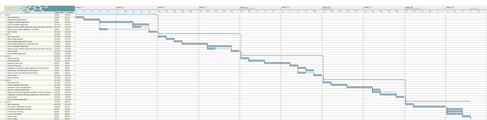
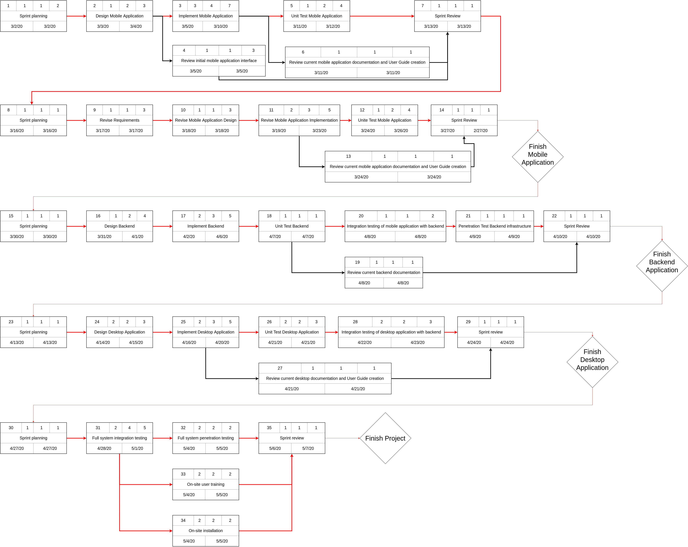
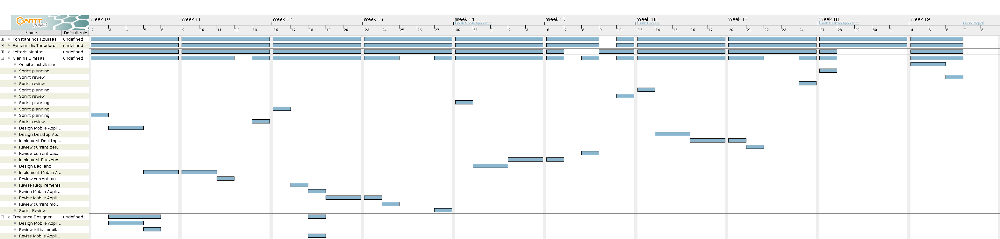
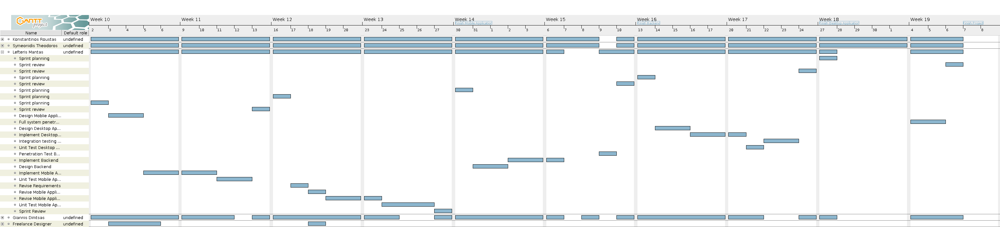
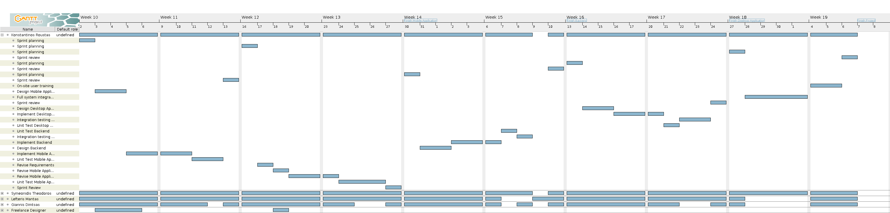
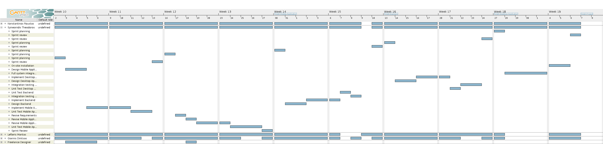
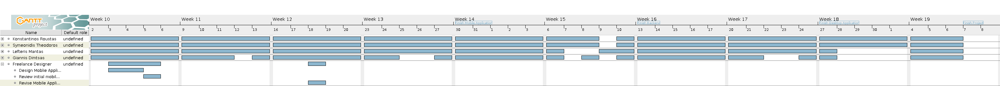

% Project Plan v1.0
% Move around
% 

\newpage

## Μέλη ομάδας
* Δήμτσας Γιάννης 1054423
* Μαντάς Ελευθέριος 1047128
* Ρούστας Κωνσταντίνος 1054422
* Συμεωνίδης Θεόδωρος 1064870

## Editor
* Συμεωνίδης Θεόδωρος 1064870

## Peer Reviewer
* Δήμτσας Γιάννης 1054423
* Μαντάς Ελευθέριος 1047128
* Ρούστας Κωνσταντίνος 1054422
* Συμεωνίδης Θεόδωρος 1064870

## Εργαλεία
Markdown, VSCode, GanttProject, Pandoc, Lightshot, [Table generator](https://www.tablesgenerator.com/), [Mockflow](https://www.mockflow.com/), VisualParadigm, [Diagrams.net](https://app.diagrams.net/)

\newpage

## Changelog
### v0.2
* Επανασχεδίαση του PERT chart στο VisualParadigm.
* Προσθήκη milestones στο PERT και Gantt chart.
* Προσθήκη της ανάγκης για πρόσληψη UI/UX designer στο συνολικό χρονοπρογραμματισμό και ανανέωση των κατάλληλων πεδίων ανάθεσης έργου σε ανθρώπινο δυναμικό και κόστους.
* Αφαίρεση της συνδρομής στο Lucid-chart από τα κόστη και προσθήκη του τέλους ενεργοποίησης του App Store.
* Μικρές αλλαγές στη μορφοποίηση.

### v1.0
Eίναι η έκδοση v0.2 χωρίς καμία αλλαγή.

\newpage

## Μέθοδος οργάνωσης
Αρχικά επιλέξαμε πως θα χρησιμοποιήσουμε τη μεθοδολογία SCRUM της οικογένειας Agile για την υλοποίηση του project μας. Καθώς έχουμε να κάνουμε με κοινωνικές ομάδες με ιδιόμορφες ανάγκες τις οποίες μπορεί να μην έχουμε κατανοήσει πλήρως εξ' αρχής. Το δυναμικό αυτό περιβάλλον απαιτήσεων απαιτεί μια επαναληπτική μεθοδολογία με συνεχές feedback. Πιο συγκεκριμένα η μεθοδολογία SCRUM πιστεύουμε πως θα είναι αποτελεσματική λόγω των προδιαγραφών της αλλά και λόγω της εμπειρίας που θα έχουν τα μέλη της ομάδας μας διότι την επιλέξαμε και σαν μέθοδο οργάνωσης αυτού του project (βλ. Team-plan).
Αποφασίσαμε επίσης για το λόγο ότι είμαστε μικρή ομάδα, να χρησιμοποιήσουμε part-time scrum master. Δηλαδή κάποιος από εμάς που πιστεύουμε έχει ικανότητες πιο κοντά σε αυτές ενός scrum master, θα αναλάβει το ρόλο αυτό, παραμένοντας ωστόσο μέλος του development team.

## Χρονοπρογραμματισμός
Συνολικά το project θα διαρκέσει 5 sprints των 2 εβδομάδων (στην μέση περίπτωση). Τα 2 από αυτά αποφασίσαμε να τα αφιερώσουμε στην δημιουργία της εφαρμογής για κινητά, 1 στο backend, 1 στην εφαρμογή για υπολογιστές (που θα χρησιμοποιούν οι υπάλληλοι) και 1 στην εγκατάσταση και παράδοση του έργου.

Αποφασίσαμε ότι λόγω των ιδιόμορφων αναγκών του target group της εφαρμογής μας, θα χρειαστεί να συνεργαστούμε με έναν UI/UX designer, ο οποίος μας προσφέρει συμβουλές σχετικά με την σχεδίαση και τη βελτίωση της διεπαφής της εφαρμογής των κινητών, και θα είναι εξειδικευμένος σε εφαρμογές Α.Μ.Ε.Α. . Για αυτό το σκοπό κρίναμε ότι ένας freelancer είναι η κατάλληλη επιλογή, αφού πρόκειται για μικρό όγκο εργασίας και δεν θέλουμε να σπαταλήσουμε χρόνο με γραφειοκρατικά ζητήματα.

Επίσης, στην προσπάθεια μας να ανταποκριθούμε στις σύγχρονες ανάγκες που δημιουργούν η επεξεργασία και αποθήκευση προσωπικών δεδομένων χρηστών και οι ολοένα αυξανόμενες παραβιάσεις διαδικτυακών εφαρμογών. Εντάξαμε σε κάθε επιμέρους sprint υποέργα που αφορούν τον έλεγχο της ασφάλειας των εφαρμογών και των υποδομών αλλά και κατά πόσο αυτή συμβαδίζει με τους στόχους που έχουν τεθεί κατά τη σχεδίαση. Ωστόσο, δεν θα χρειαστεί να το αναθέσουμε σε κάποιο εξωτερικό συνεργάτη διότι μέλη τις ομάδας μας κατέχουν της απαραίτητες δεξιότητες.

Υποθέτουμε ότι το κάθε Task στο σχήμα αντιστοιχεί σε ένα Τεχνικό Υποέργο (ΤΥ) και το κάθε Sprint σε ένα Milestone. 

\newpage

## Ανάθεση έργου σε ανθρώπινο δυναμικό

\newpage

## Εκτίμηση κόστους
Γίνονται οι εξής υποθέσεις:

* Η εφαρμογή αναπτύσσεται στα πλαίσια διαγωνισμού που έχει προκηρύξει κάποιος Δήμος στον οποίο και θα συμμετέχουμε ως εταιρεία η οποία προϋπάρχει.
* Υποθέτουμε ότι ο μέσος μηνιαίος μικτός μισθός πλήρης απασχόλησης ενός προγραμματιστή του επιπέδου μας για 1 μήνα στην Ελλάδα είναι 1200 ΕΥΡΩ (μεικτά).
* Υποθέτουμε ότι ενοικιάζουμε έναν μικρό χώρο από όπου εργάζεται η ομάδα μας.
* Τα κόστη έχουν στρογγυλευθεί προς τα πάνω στις δεκάδες και έχουν προέλθει από συνδυασμό δικής μας έρευνας αλλά και εκτίμησης βάσει της εμπειρίας μας.

### Άμεσο κόστος
* Κόστος εργατικού δυναμικού της ομάδας μας (1200 ΕΥΡΩ/ΜΗΝΑ * 5 ΜΕΛΗ * 3 ΜΗΝΕΣ = **18000 ΕΥΡΩ**)
* Κόστος freelancer UI/UX developer (**300 ΕΥΡΩ**)
* VPS για το περιβάλλον ελέγχου (70 ΕΥΡΩ/ΜΗΝΑ * 2 ΜΗΝΕΣ = **140 ΕΥΡΩ**)
* Επί πληρωμή υπηρεσίες λογισμικού (Trello, Github, Lucidchart, GooglePlay)
    1. Trello : 13 ΕΥΡΩ/ΜΗΝΑ * 3 ΜΗΝΕΣ * 5 ΜΕΛΗ = **180 ΕΥΡΩ**
    2. Github : 7 ΕΥΡΩ/ΜΗΝΑ * 3 ΜΗΝΕΣ * 5 ΜΕΛΗ = **110 ΕΥΡΩ**
    3. App Store : **100 ΕΥΡΩ**
    4. GooglePlay : **30 ΕΥΡΩ**

    Σύνολο : **360 ΕΥΡΩ**
* Δραστηριότητες ενίσχυσης ομαδικού πνεύματος (**200 ΕΥΡΩ**)
* Εκπαίδευση ομάδας σε τεχνολογίες με την αγορά online courses σε συγκεκριμένα tools (*300 ΕΥΡΩ*)

Υποσημείωση : Το κόστος του App Store είναι ετήσιο, για αυτό μετά τον πρώτο χρόνο σε περίπτωση που ο Δήμος θέλει να κρατήσει την εφαρμογή λειτουργική το αναλαμβάνει αυτός.

### Έμμεσο κόστος
* Κόστος ενοικίασης χώρου (200 ΕΥΡΩ/ΜΗΝΑ * 3 ΜΗΝΕΣ = **600ΕΥΡΩ**)
* Λοιπά έξοδα χώρου (180 ΕΥΡΩ/ΜΗΝΑ * 3 ΜΗΝΕΣ = **540ΕΥΡΩ**)
* Εταιρικό VPN και VPS για προσωπική μας χρήση (**100 ΕΥΡΩ**)
* Νομικά (**500 ΕΥΡΩ**)

Συνολικό κόστος : **21000 ΕΥΡΩ**
