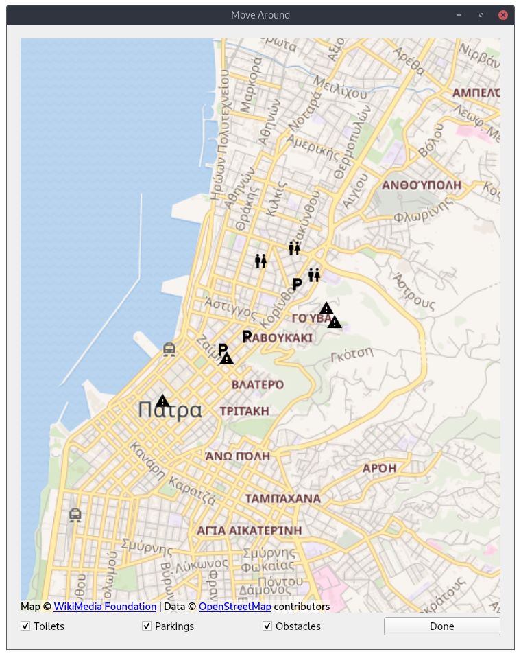

## Clone project
```bash
git clone https://github.com/Elite-Build-Team/move-around.git
```

## Install prerequisites

You should have `python3` and `pip` and `virtualenv3` installed and available in your PATH (replace with `python` and `virtualenv` accordingly if python version 3 is your default version). Then execute the following:

```bash
cd move-around/src
virtualenv3 .
source bin/activate
pip3 install -r requirements.txt
```

## Run
```bash
python3 ui.py
```

## Demo


## Screenshots

### Κύρια οθόνη


### Χάρτης Πρόσβασης
#### Οθόνη 1


#### Οθόνη 2


### Αναφορά προβλήματος
#### Οθόνη 1


#### Οθόνη 2


#### Οθόνη 3

